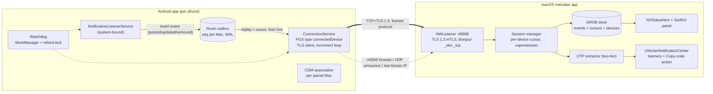

# Eko — Android notifications on your Mac

**Technical plan, v1.0 — 2026-07-24**

Eko is a macOS menubar app plus an Android companion app. The Android app captures notifications
on one or more phones and forwards them over the local Wi-Fi network to the Mac, where they are
shown live, can be copied, and — for 2FA/OTP messages — offer a one-click "copy code" action.

The two hard product requirements that drive every design decision below:

1. **Stable and self-healing.** When a phone drops off the network (Wi-Fi loss, Doze, process
   death, Mac asleep) and later reconnects, the Mac must recover every notification it missed.
2. **Multiple phones per Mac**, each independently paired, connected, and recoverable.

Later versions add Internet connectivity (outside the LAN) and screen sharing. v1 is LAN-only,
but the architecture leaves explicit seams for both (§13).

This plan is based on primary-source research (Android/Apple developer documentation, AOSP
source, KDE Connect/LocalSend/scrcpy source, issue trackers) done in July 2026. Sources are
listed per section in §16. Findings that must be re-verified on real hardware before they are
load-bearing are collected as explicit spikes in §14.

---

## Table of contents

1. [What the research says — constraints that shape the design](#1-what-the-research-says--constraints-that-shape-the-design)
2. [Goals and non-goals](#2-goals-and-non-goals)
3. [Locked-in decisions at a glance](#3-locked-in-decisions-at-a-glance)
4. [System architecture](#4-system-architecture)
5. [Android app](#5-android-app)
6. [macOS app](#6-macos-app)
7. [Discovery, pairing, and security](#7-discovery-pairing-and-security)
8. [Wire protocol](#8-wire-protocol)
9. [Store-and-forward: the self-healing core](#9-store-and-forward-the-self-healing-core)
10. [OTP / 2FA code extraction](#10-otp--2fa-code-extraction)
11. [UI design](#11-ui-design)
12. [Failure modes and recovery matrix](#12-failure-modes-and-recovery-matrix)
13. [Future features: Internet transport and screen sharing](#13-future-features-internet-transport-and-screen-sharing)
14. [Risks and early spikes](#14-risks-and-early-spikes)
15. [Roadmap, repo layout, testing](#15-roadmap-repo-layout-testing)
16. [Sources](#16-sources)

---

## 1. What the research says — constraints that shape the design

### 1.1 Android 15+ redacts OTP codes from notification listeners — the single biggest constraint

Since Android 15, Android System Intelligence classifies notifications containing 2FA/OTP codes
as "sensitive". An ordinary `NotificationListenerService` (NLS) still receives the notification
event, but its text is replaced with the system string *"Sensitive notification content
hidden"*. This silently breaks Eko's headline feature on Android 15/16 — it broke Microsoft
Phone Link's OTP mirroring too (only OEM-preinstalled system builds of Link to Windows got it
back), and it is an open bug for KDE Connect (KDE bug 495146).

The gate is `android.permission.RECEIVE_SENSITIVE_NOTIFICATIONS` (protection level
`signature|role` — a normal app **cannot** request it). However, the AOSP trust check
(`NotificationManagerService.isAppTrustedNotificationListenerService()`, verified in AOSP main,
July 2026) treats a listener as trusted if **any** of these hold:

- it holds `RECEIVE_SENSITIVE_NOTIFICATIONS` (system/role apps only), or
- it is platform-signed, or
- the `RECEIVE_SENSITIVE_NOTIFICATIONS` app-op was granted (adb workaround), or
- **the package has any non-revoked `CompanionDeviceManager` (CDM) association for the user —
  any profile, including a plain profile-less association, which any third-party app can
  create freely.**

**Design consequence:** the Android onboarding *must* establish a CDM association per paired
Mac before the OTP feature is advertised as working. Eko is distributed by **sideloading only**
(no Play Store — §5.5), so store policy never constrains us, but CDM is still the primary path:
it is the only route that needs neither adb nor a settings change, and it also buys
background-execution exemptions (§5.3). Sideloading widens the fallback menu, in order of
preference: (a) profile-less CDM association (default — zero friction beyond one system
dialog), (b) watch-profile association (`DEVICE_PROFILE_WATCH` via
`REQUEST_COMPANION_PROFILE_WATCH`, a normal permission), which grants the
`COMPANION_DEVICE_WATCH` role and with it `RECEIVE_SENSITIVE_NOTIFICATIONS` outright —
evaluate in spike S1, (c) a documented one-time adb app-op grant
(`appops set <pkg> RECEIVE_SENSITIVE_NOTIFICATIONS allow`), (d) disabling "Enhanced
notifications" (turns off OTP classification system-wide). Do **not** design around
`DEVICE_PROFILE_COMPUTER` or self-managed associations — the required permissions are
`signature|privileged` and unavailable even to sideloaded apps.

### 1.2 Nobody does store-and-forward — recovery must be event-sourced on the phone

Verified against source: KDE Connect has **no** store-and-forward. On reconnect the desktop
sends `{"request": true}` and the phone replays only `getActiveNotifications()` — notifications
still sitting in the status bar. Anything posted *and dismissed* while the desktop was offline
(exactly the lifecycle of an OTP) is lost forever. Pushbullet's mirroring "ephemerals" are
explicitly not stored; Join rides on FCM, which caps offline queues at 100 non-collapsible
messages and drops all of them on overflow.

**Design consequence:** the phone persists every notification event to a local SQLite outbox
*at post time, before any send attempt*, with a per-Mac monotonic sequence number, and replays
from the Mac's last-acknowledged cursor on reconnect. `getActiveNotifications()` is only a
reconciliation snapshot, never the recovery mechanism. This is genuinely novel in this product
space and architecturally cheap (§9).

### 1.3 Android will kill the app; correctness must not depend on the process surviving

Doze, App Standby Buckets, and above all OEM battery managers (Samsung sleeps "unused" apps
after 3 days; Huawei's PowerGenie kills non-whitelisted apps outright; Xiaomi requires an
Autostart permission; dontkillmyapp.com documents "no known dev-side solution" for several)
will kill the connection service no matter what we do. Mitigations exist (foreground service of
type `connectedDevice`, CDM exemptions, per-OEM user guidance) and are all in §5.3 — but the
architecture treats process death as *routine*: the durable outbox means a killed app loses the
connection, never the data.

### 1.4 The Mac must be the server, the phone the client

An Android *listening* socket dies with the process and nothing external can restart the app on
an incoming LAN connection. The reverse direction is robust: the Mac runs a persistent
`NWListener`; the phone knows its own connectivity (`ConnectivityManager` callbacks) and
reconnects from its foreground service. Bonus (Apple TN3179, verified): on macOS 15+ *accepting
incoming TCP connections requires no Local Network permission* — only Bonjour
advertising/browsing does — so the core data path keeps working even if the user denies the
prompt and falls back to direct-IP connection.

### 1.5 Discovery is a hint, never an authority

UDP broadcast fails on AP-isolated/guest/mesh networks; mDNS is filtered on others and on some
Wi-Fi chips unless a `MulticastLock` is held (which drains battery if held permanently).
"Devices can't see each other" is KDE Connect's #1 support ticket. Eko therefore layers four
discovery mechanisms (mDNS, UDP announce, last-known-IP dialing, manual/QR entry) and treats
all of them purely as *connection hints* — only the authenticated TLS session defines
online/offline, and only pinned certificates define identity (§7).

---

## 2. Goals and non-goals

### v1 goals

- Mirror notifications from N Android phones to one Mac over the same Wi-Fi network, live.
- Menubar UI: browse, search, copy notification text; per-app filters; per-device grouping.
- Native macOS notification banners with a "Copy code" action for detected OTPs.
- One-click (opt-in: automatic) extraction of 2FA codes, robust across languages and formats.
- Store-and-forward: zero notification loss across Wi-Fi drops, Doze, process death, Mac
  sleep, reboots — bounded by an explicit retention window (48 h / 2'000 events per Mac), with
  an honest "gap" indicator when the window is exceeded.
- Mirror dismissals both ways (dismiss on Mac → dismissed on phone, and vice versa).
- Pairing that a non-technical user can complete, with a security model an expert can audit.
- Survive Android 15/16 OTP redaction via CDM association; survive macOS 15+ local-network
  privacy; ready for Android 17's `ACCESS_LOCAL_NETWORK` runtime permission.

### v1 non-goals (explicitly deferred)

- Internet/remote connectivity (v2 — but the protocol is transport-agnostic from day one).
- Screen sharing/mirroring (v3 — MediaProjection + WebRTC; seams reserved in the protocol).
- Notification *actions* beyond dismiss (inline reply etc. — protocol reserves fields).
- SMS-specific features (sending SMS, call log). Sideloading would permit the permissions, but
  NLS already covers SMS notifications; direct `READ_SMS` capture stays a possible v1.x opt-in
  module (§5.5), not v1 scope.
- iOS, Windows, Linux.
- **Google Play distribution** — Eko is sideload-only by design (§5.5). Play policy
  considerations in this document are historical context, not constraints.
- Mac App Store distribution (Developer ID first; sandbox on from day one so MAS stays open).

---

## 3. Locked-in decisions at a glance

| # | Decision | Why (short) |
|---|----------|-------------|
| D1 | Phone = TCP/TLS **client**, Mac = **server** (`NWListener`, fixed port, default 48808) | Android can't hold a listening socket in background; macOS 15 doesn't gate incoming TCP (§1.4) |
| D2 | Transport: TCP + **TLS 1.3, mutual auth**, 4-byte length-prefixed frames, 1-byte frame type (JSON control/events now; binary type reserved) | Simplest robust option; QUIC/gRPC add complexity with no v1 payoff; binary frame type future-proofs icons/media |
| D3 | Identity = per-device long-lived **self-signed P-256 cert**; deviceId = SHA-256 fingerprint; TOFU pinning at pairing; short verification code | KDE Connect model, hardened with the CVE-2025-66270 lesson: identity claims only count post-TLS |
| D4 | **Phone-side durable outbox** (Room/SQLite, WAL); `AUTOINCREMENT` rowid = per-pairing sequence number; Mac is cursor authority; cumulative acks | The self-healing core; survives process death, unlike every in-memory scheme (§9) |
| D5 | **CDM association per paired Mac** (profile-less or watch-profile; associate via Mac's BLE advertisement, fallback Wi-Fi-AP association) | Unlocks unredacted OTPs on Android 15/16 + background exemptions with zero adb/settings friction (§1.1, §5.3); adb app-op grant and "Enhanced notifications" opt-out are documented fallbacks |
| D6 | Android foreground service type **`connectedDevice`** (never `dataSync`) | No timeout; legal to start from `BOOT_COMPLETED`; `dataSync` has a 6 h/24 h hard limit on Android 15 |
| D7 | OTP extraction runs **on the Mac**, two-tier (deterministic standards first, keyword-gated heuristics second) | Rules iterate with a Mac-app update alone (no phone-side APK rollout); backlog can be re-scanned retroactively; single Swift test corpus |
| D8 | macOS UI: **AppKit `NSStatusItem` + custom panel hosting SwiftUI** (`NSHostingView`); min target macOS 14 | SwiftUI `MenuBarExtra` still lacks presentation-state/window APIs as of Xcode 26; `.menu` style can't host a live feed |
| D9 | Mac persistence: **GRDB 7** (SQLite, WAL, `ValueObservation`); identity key in data-protection Keychain; peer certs in DB | ~20× SwiftData insert performance, reactive UI queries, FTS5 for search later |
| D10 | Distribution: **Developer ID + notarization** on macOS, sandbox enabled from day one; **sideloaded APK** on Android (GitHub Releases + in-app update check / Obtainium) | macOS 15 removed the Gatekeeper ctrl-click bypass; sideload-only Android distribution frees the design from Play policy (§5.5) |
| D11 | Discovery: mDNS/Bonjour (`_eko._tcp`) + UDP announce (port 48809) + last-known-IP dial + QR/manual — hints only | Every single mechanism fails on some real network (§1.5) |
| D12 | App-level heartbeat (phone ping every 25 s, hard-close on one missed pong; Mac timeout 90 s) + full-jitter backoff capped at 60 s | TCP keepalive alone leaves half-open zombies for minutes-to-hours; KDE Connect and Phone Link both show stale "connected" states |

---

## 4. System architecture



Each paired phone is an independent unit on the Mac: its own pinned certificate, session,
cursor, backlog state, and UI section. Nothing is shared between phones except the listener
socket and the database.

Both apps are built around one shared, versioned protocol spec (`/protocol` in the repo) with
language-neutral test vectors consumed by both the Kotlin and Swift test suites.

---

## 5. Android app

### 5.1 Components

| Component | Type | Responsibility |
|-----------|------|----------------|
| `EkoNotificationListener` | `NotificationListenerService` | Capture posted/updated/removed events; write them to the outbox synchronously in the callback; detect redaction; reconcile via `getActiveNotifications()` on (re)connect |
| `ConnectionService` | Foreground service, `foregroundServiceType="connectedDevice"` | Own the TLS client sockets (one per paired Mac), reconnect loop, heartbeats, outbox drain, ack handling |
| Outbox | Room/SQLite (WAL) | Durable event log; per-Mac sequence numbers; pruning on ack + retention caps |
| `PairingManager` | Activity flow + CDM | Discovery UI, QR scan, TOFU cert exchange, verification code, CDM `associate()` |
| Watchdog | WorkManager (15 min) + event triggers | Detect NLS silence and connection staleness; `requestRebind()`; component-toggle kick; FGS restart |
| Receivers | `BOOT_COMPLETED`, `MY_PACKAGE_REPLACED`, connectivity callbacks | Restart `ConnectionService`; trigger immediate reconnect on network change |
| Settings/Onboarding UI | Jetpack Compose | Permission checklist, per-app forwarding rules, OEM reliability guide, diagnostics |

Stack: Kotlin, coroutines/Flow, Room, Jetpack Compose, `minSdk 26` (Android 8.0), `targetSdk`
current (35+). No Firebase dependency in v1 (LAN-only; FCM arrives with v2). TLS via the
platform `SSLSocket`/Conscrypt with a custom pin-checking `X509TrustManager` — no OkHttp needed
for a raw socket protocol, no Netty.

### 5.2 Notification capture details

- Manifest service guarded by `android.permission.BIND_NOTIFICATION_LISTENER_SERVICE` with the
  `android.service.notification.NotificationListenerService` intent-filter action;
  `android:exported="false"`.
- Grant flow deep-links to the app's own row:
  `Settings.ACTION_NOTIFICATION_LISTENER_DETAIL_SETTINGS` +
  `EXTRA_NOTIFICATION_LISTENER_COMPONENT_NAME` (API 30+; fall back to the generic listener
  settings screen below that). Poll state with
  `NotificationManager.isNotificationListenerAccessGranted(ComponentName)`.
- Extract per event: `getKey()` (opaque identity — never parsed), package, post time,
  `EXTRA_TITLE`, `EXTRA_TEXT`, `EXTRA_BIG_TEXT`, `EXTRA_SUB_TEXT`, `EXTRA_INFO_TEXT`,
  `EXTRA_SUMMARY_TEXT`, `EXTRA_TEXT_LINES`, MessagingStyle messages
  (`NotificationCompat.MessagingStyle.extractMessagingStyleFromNotification`) — each extra as a
  **separate structured field** so the Mac-side extractor has full context; app label resolved
  locally; category; `isClearable`; group key + `FLAG_GROUP_SUMMARY`.
- Skip `FLAG_ONGOING_EVENT`/`FLAG_FOREGROUND_SERVICE` notifications by default (media players,
  navigation, our own FGS notification) — configurable per app.
- `onNotificationRemoved` forwards the `REASON_*` code so the Mac can distinguish user dismissal
  (mirror it) from app-side cancel and from our own `cancelNotification()` round-trips.
- Mac-initiated dismissal: `cancelNotification(key)`.
- On `onListenerConnected`: run reconciliation — diff `getActiveNotifications()` against the
  last known active set, synthesizing `removed` events for anything that vanished while the
  listener was dead (these carry `reason = RECONCILED`).
- **Redaction self-check:** compare incoming text against the system string
  `redacted_notification_message` (`Resources.getSystem().getIdentifier(...)`). If detected, the
  CDM trust path is broken (association revoked, OEM quirk) — surface a repair card in the app
  and a warning on the Mac instead of silently forwarding "Sensitive notification content
  hidden".

Android 13+ listener filtering metadata (`default_filter_types`) is set to
conversations|alerting|silent (ongoing excluded) — an optimization only; correctness never
depends on it (the constants don't exist below API 33).

### 5.3 Background survival strategy (layered, in order of importance)

1. **The outbox, not the process, guarantees correctness** (§9). Everything below only improves
   *latency*, never *completeness*.
2. **NLS binding itself.** The system binds enabled listeners with
   `BIND_AUTO_CREATE | BIND_FOREGROUND_SERVICE` (verified in AOSP `ManagedServices`), putting
   the process at bound-foreground-service state: auto-restarted after kills and inside the
   Doze/battery-saver network allowlist on stock Android. This is why capture keeps working
   even when the connection service is throttled.
3. **Foreground service** `connectedDevice` (requires `FOREGROUND_SERVICE` +
   `FOREGROUND_SERVICE_CONNECTED_DEVICE`; prerequisite satisfied via `CHANGE_WIFI_STATE` /
   `CHANGE_WIFI_MULTICAST_STATE`, both normal). **No timeout**, unlike `dataSync` (hard
   6 h/24 h limit on Android 15+ and banned from `BOOT_COMPLETED` starts). Restarted from
   `BOOT_COMPLETED` / `MY_PACKAGE_REPLACED` receivers, catching
   `ForegroundServiceStartNotAllowedException` (KDE Connect pattern). (Sideload-only: the Play
   Console FGS-type declaration/demo-video requirement does not apply to us.)
4. **CDM association** (also required for OTPs, §1.1): with manifest-declared
   `REQUEST_COMPANION_RUN_IN_BACKGROUND` + `REQUEST_COMPANION_USE_DATA_IN_BACKGROUND` (both
   `normal`), an active association puts the app on the **permanent Doze power allowlist on
   Android 12–15** and exempts it from the restricted standby bucket and permission auto-revoke.
   On **Android 16 the power-allowlist exemption became presence-gated** (BLE/BT appear events
   only; Wi-Fi devices explicitly unsupported for presence) — hence the Mac advertises a BLE
   peripheral (§7.2) so `startObservingDevicePresence` works. Note the *redaction-trust* benefit
   is not presence-gated — any non-revoked association suffices.
5. **Reconnect triggers**, in priority order: `ConnectivityManager.registerNetworkCallback`
   (TRANSPORT_WIFI/ETHERNET/VPN only — never cellular in v1) → cached last-known Mac IP:port
   dial → short mDNS scan windows holding `MulticastLock` only while scanning → WorkManager
   15-min periodic reconcile (runs in Doze maintenance windows) →
   `AlarmManager.setAndAllowWhileIdle` watchdog (throttled to ~1/9 min in Doze; exact alarms
   add little — `SCHEDULE_EXACT_ALARM` is denied by default for targetSdk 34+ and still
   subject to Doze batching; not worth the extra user prompt).
6. **NLS watchdog.** The classic failure: listener alive but silently receiving nothing until
   reboot. Detection: no `onNotificationPosted` for an implausible interval *while the phone is
   in use* (screen-on heuristics), or `isNotificationListenerAccessGranted` true but
   `onListenerConnected` never fired since process start. Recovery ladder:
   `requestRebind(cn)` → component toggle
   (`setComponentEnabledSetting(DISABLED, DONT_KILL_APP)` → `ENABLED` → `requestRebind`) →
   user-facing card asking to toggle notification access off/on.
7. **Battery-optimization exemption:** rely on CDM first (it grants the real Doze allowlist on
   Android 12–15 silently). Additionally — since sideload-only distribution removes the Play
   policy risk that burned Syncthing-Android (#1039) — the onboarding checklist directly
   requests the exemption via `ACTION_REQUEST_IGNORE_BATTERY_OPTIMIZATIONS`
   (`REQUEST_IGNORE_BATTERY_OPTIMIZATIONS` permission) as an optional "maximum reliability"
   step, with the `ACTION_IGNORE_BATTERY_OPTIMIZATION_SETTINGS` deep-link as manual fallback.
   State is checked via `PowerManager.isIgnoringBatteryOptimizations()`.
8. **OEM reliability guide** keyed on `Build.MANUFACTURER` (Samsung: never-sleeping apps +
   disable 3-day auto-sleep; Xiaomi/HyperOS: Autostart + battery "No restrictions" + lock in
   recents; Huawei: manual app-launch, PowerGenie caveat; OnePlus: disable optimization), with
   links to dontkillmyapp.com. Shown during onboarding, re-surfaced by **stall detection**: the
   app compares NLS post-timestamps against forward-timestamps and prompts only when the gap
   proves the OS actually killed forwarding — no cry-wolf prompts.
9. **User-visible honesty:** Android 13+ users can swipe away the FGS notification or stop the
   app from Task Manager. Treat that as a signal (show "forwarding paused" state on the Mac),
   not an error to fight.

### 5.4 Android permissions inventory

Sideload-only distribution means no store policy gates any of these — the constraint on each
choice is purely OS behavior and user trust (ask for the minimum, explain every prompt).

| Permission / access | Kind | Purpose |
|---|---|---|
| Notification access (NLS) | Special access, user toggle | Capture notifications (prominent in-app disclosure stays — good practice, not policy) |
| `POST_NOTIFICATIONS` | Runtime | FGS notification, alerts |
| `FOREGROUND_SERVICE`, `FOREGROUND_SERVICE_CONNECTED_DEVICE` | Normal | Connection service |
| `RECEIVE_BOOT_COMPLETED` | Normal | Restart after reboot |
| `INTERNET`, `ACCESS_NETWORK_STATE`, `CHANGE_WIFI_STATE`, `CHANGE_WIFI_MULTICAST_STATE` | Normal | Sockets, network callbacks, mDNS multicast lock, FGS prerequisite |
| `REQUEST_COMPANION_RUN_IN_BACKGROUND`, `REQUEST_COMPANION_USE_DATA_IN_BACKGROUND`, `REQUEST_OBSERVE_COMPANION_DEVICE_PRESENCE` | Normal | CDM exemptions + presence |
| `REQUEST_COMPANION_PROFILE_WATCH` | Normal | Watch-profile CDM association, if S1 lands on it |
| `BLUETOOTH_SCAN` (`neverForLocation`), `BLUETOOTH_CONNECT` | Runtime (Android 12+) | CDM association against the Mac's BLE advertisement |
| `REQUEST_IGNORE_BATTERY_OPTIMIZATIONS` | Normal (dialog on request) | Optional "maximum reliability" onboarding step (§5.3.7) |
| `ACCESS_LOCAL_NETWORK` | Runtime (Android 17 targets) | Declared now; requested in onboarding once targeting API 37 |
| `REQUEST_INSTALL_PACKAGES` | Special access | In-app self-update (§5.5); optional — omitted when the user updates via Obtainium |
| `CAMERA` | Runtime, optional | QR pairing only |

Deliberately **not** used in v1: `READ_SMS`/`RECEIVE_SMS` — sideloading would allow them, but
NLS already covers SMS via the default SMS app's notifications; a direct-SMS capture module
(immune to notification redaction and NLS flakiness) is a possible v1.x opt-in (§5.5).
Also not used: `QUERY_ALL_PACKAGES` (app labels come from the notifying package only),
`SYSTEM_ALERT_WINDOW`, exact-alarm permissions, Accessibility.

### 5.5 Distribution and updates (sideload-only)

- **Channel:** signed APK on GitHub Releases (universal APK; split ABIs only if size ever
  matters). No Play Store, no Play App Signing — **we hold the one signing key**, and it must
  never rotate casually: a key change forces uninstall/reinstall, which wipes the outbox,
  notification-access grant, CDM associations, and changes the app's uid (invalidating stored
  notification keys). Back the keystore up like a production secret.
- **Updates:** two supported paths — (a) recommend **Obtainium** (points at the GitHub repo,
  handles update checks and installs; zero code on our side), and (b) a built-in lightweight
  update check against the GitHub Releases API with in-app download + install prompt
  (`REQUEST_INSTALL_PACKAGES`). The in-app updater is a v1.x nicety; v1.0 ships with a "new
  version available" notice + link.
- **Install friction is an onboarding concern:** first-time sideloading requires the user to
  allow "Install unknown apps" for their browser/file manager — the Mac-side pairing wizard
  shows a QR link to a short install guide covering this, per Android version.
- **targetSdk policy:** without Play's annual targetSdk ratchet, we control the pace of
  adopting behavior changes. Still track current targetSdk closely (Android 15's redaction
  applies regardless of targetSdk, so lagging buys little there) — but disruptive gates like
  Android 17's `ACCESS_LOCAL_NETWORK` runtime permission can be adopted deliberately, with the
  UX ready, instead of on a store deadline.
- **Crash/diagnostics telemetry stays opt-in and local-first** (export-a-file diagnostics
  before any network telemetry); sideload users self-select for privacy sensitivity.

---

## 6. macOS app

### 6.1 Shell and lifecycle

- `LSUIElement = true` (accessory app, no Dock icon). Menubar presence via **`NSStatusItem`**
  with a custom **`NSPanel`** hosting SwiftUI content through `NSHostingView` (D8). SwiftUI
  `MenuBarExtra` is not usable: `.menu` style blocks the run loop and can't host live views;
  `.window` style still has no API for presentation state, the status item, or the panel window
  as of Xcode 26 (would force the MenuBarExtraAccess introspection hack), plus known
  `SettingsLink`/`openSettings` breakage. Settings opens as a regular window (temporarily
  flipping activation policy to `.regular` — a known, budgeted AppKit workaround).
- Minimum target **macOS 14 Sonoma** (13 is EOL; 14/15/26 receive security updates; macOS 27 is
  Apple-Silicon-only and ships fall 2026).
- Launch at login via `SMAppService.mainApp.register()`, handling `.requiresApproval` with
  `SMAppService.openSystemSettingsLoginItems()`. Registration fails with error 78 outside
  /Applications — onboarding checks the app's location.
- Fully event-driven for energy: Network.framework state/viability/path handlers +
  `NWPathMonitor`; kernel TCP keepalive; **no polling timers**. App Nap is acceptable — incoming
  socket data wakes the process. `NSBackgroundActivityScheduler` for DB pruning. Relative
  timestamps render on panel-open, not on a ticking timer.

### 6.2 Networking

- One `NWListener` on a fixed, persisted TCP port (default **48808**, falling back to a random
  port with a user-visible notice on bind failure — LocalSend's fixed-port collisions taught
  this), bound to the wildcard address so DHCP/interface changes don't invalidate it.
- TLS 1.3 minimum, mutual authentication:
  `sec_protocol_options_set_local_identity` (identity from the data-protection Keychain),
  `set_peer_authentication_required(true)`, and a `sec_protocol_options_set_verify_block` that
  anchors **exactly** the paired phones' pinned DER certs (`SecTrustSetAnchorCertificates` +
  `AnchorCertificatesOnly`) — plus a pairing mode that accepts unknown certs into the TOFU flow.
- Bonjour advertisement `_eko._tcp` with a TXT record carrying the cert fingerprint and
  protocol version hint. Info.plist ships `NSLocalNetworkUsageDescription` and
  `NSBonjourServices` (macOS 15 requirement). Denial is a **first-class degraded state**, not an
  error: Bonjour ops stick in `.waiting` with `kDNSServiceErr_PolicyDenied` (-65570) /
  `unsatisfiedReason == .localNetworkDenied` — the UI shows "Local Network access is off —
  discovery disabled; direct connections still work" with a deep link to System Settings.
  The system auto-retries after grant; never treat `.waiting` as fatal. There is **no way to
  reset this privilege** for testing except VM snapshots/fresh users — plan QA accordingly.
- App Sandbox on from day one: `com.apple.security.network.server` + `.network.client`.
  (There is no `network.local` entitlement — that's folklore.)
- BLE peripheral advertisement via CoreBluetooth (`CBPeripheralManager`) with a fixed Eko
  service UUID — solely so phones can CDM-associate and observe presence (§5.3, §7.2).

### 6.3 Storage and secrets

- **GRDB 7** (`DatabasePool`, WAL). Tables: `device` (id = cert fingerprint, name, pinned cert
  DER, cursor, last IP, capabilities, gap flag), `event` (device, seq, kind, notification key,
  payload JSON, received_at), `notification` (materialized current state per key — what the UI
  lists), `otp` (extracted codes linked to notifications). `ValueObservation` drives the SwiftUI
  panel reactively. Unique `(device_id, seq)` enforces idempotent ingest.
- Mac identity: P-256 key generated with `SecKeyCreateRandomKey` into the **data-protection
  keychain** (`kSecUseDataProtectionKeychain: true` on every call; the file-based keychain API
  is deprecated and prompts); self-signed cert built with Apple's `swift-certificates`. Peer
  (phone) certificates are public data → stored as DER in GRDB, not Keychain.
- History retention: default 7 days / 5'000 notifications per device on the Mac (independent of
  the phone-side 48 h outbox), user-configurable; OTP clipboard handling in §10.

### 6.4 Native notifications

- `UNUserNotificationCenter` with `.provisional` authorization initially (quiet delivery),
  upgrade prompt in onboarding. **Signed builds only** — unsigned/ad-hoc builds silently fail to
  prompt and to post (and break local-network TCC tracking); dev builds are Developer
  ID-signed too. Verify accessory-app delivery in the first spike (one forum thread claims
  `LSUIElement` suppresses notifications; evidence points to AppleScript applets, but confirm).
- OTP notifications use a `UNNotificationCategory` with a **non-`.foreground`** "Copy code"
  action: the delegate writes to `NSPasteboard` without activating the app. Note macOS shows
  banner action buttons on hover/Options; offer alert-style guidance in settings.
- Notification identity = `(deviceId, notificationKey)`: re-posting with the same identifier
  updates the banner in place (notification updates don't spam);
  `removeDeliveredNotifications(withIdentifiers:)` retracts banners when the phone dismisses.
- **Backlog is silent**: replayed events never post banners (KDE Connect's post-reconnect
  30-popup storm is a documented user-rage generator). Instead: one summary banner — "Pixel 8
  reconnected · 12 missed notifications, 1 code" — and the missed items land in the panel's
  history, visually marked.

### 6.5 Distribution

Developer ID + `notarytool` notarization + hardened runtime (macOS 15 removed the ctrl-click
Gatekeeper bypass, so notarization is effectively mandatory). Sparkle 2 for updates post-1.0.
Single copy in /Applications (multiple copies corrupt the Local Network settings entry —
FB15568200 — and break SMAppService). Mac App Store stays possible later because the sandbox
and entitlements are MAS-compatible from day one.

---

## 7. Discovery, pairing, and security

### 7.1 Threat model (v1)

In scope: passive/active attackers on the same LAN (coffee-shop Wi-Fi): eavesdropping,
impersonating a paired device, MITM at pairing time, replay, DoS via discovery floods.
Out of scope in v1: compromised endpoints, malicious paired devices, physical access.
Notification content is highly sensitive (OTPs!) — everything crosses the wire inside mutual
TLS 1.3 with pinned certs; there is no cleartext mode and no downgrade path.

### 7.2 Identity, discovery, pairing

- **Identity is the certificate.** Each installation (phone and Mac) generates one long-lived
  self-signed P-256 cert. `deviceId := SHA-256(cert DER)`, displayed truncated. Discovery
  packets and TXT records are **hints only**; no trust decision ever keys off them
  (CVE-2025-66270 class lesson: four independent KDE Connect implementations trusted the
  cleartext deviceId and shipped an impersonation bug).
- **Discovery layering** (all optional, any one suffices):
  1. Bonjour/mDNS `_eko._tcp` (Mac advertises; phone browses via `NsdManager` —
     `registerServiceInfoCallback` on API 34+, serialized legacy `resolveService` below;
     `onServiceLost` debounced ~5 s; `MulticastLock` held only during scan windows).
  2. UDP announce on port 48809: Mac broadcasts a small signed hint packet on wake/network
     change; phone may unicast a probe to last-known Mac IPs. Packets capped at 1 KB,
     rate-limited (≥500 ms per peer), never parsed beyond hint fields (KDE Connect DoS-hardening
     constants copied: max unpaired peers tracked ≈ 42).
  3. Last-known-IP direct dial (primary reconnect path — works when all discovery is blocked).
  4. QR code / manual entry: the Mac shows a QR encoding `{host, port, certFingerprint,
     one-time pairing token}`; the phone scans it — this both discovers and pre-authenticates.
- **Pairing flow** (first connection, both sides in explicit "pairing mode"):
  1. Phone connects; TLS handshake with both sides presenting their self-signed certs
     (verify-block/TrustManager accept-unknown during pairing only).
  2. Both sides re-exchange their full identity **inside** TLS and verify that any cleartext
     claims (QR fingerprint, mDNS TXT) match the actual peer cert — mismatch aborts.
  3. Both screens display the same **verification code**: first 8 hex chars (uppercase) of
     SHA-256 over both public keys (DER, sorted bytewise descending) + the pairing timestamp;
     timestamps skewed > 30 min abort with an explicit "check your clocks" error. QR flow
     compares the scanned token instead (already second-factor-authenticated) and shows the
     code for confirmation only.
  4. User confirms on **both** devices → certs pinned on both sides → normal session starts.
  5. Phone then runs CDM `associate()` for this Mac (§1.1): profile-less (or watch-profile,
     per spike S1/S5) `AssociationRequest` with a `BluetoothLeDeviceFilter` matching the Mac's
     Eko BLE service UUID; the system consent dialog names the Mac. Fallback if BLE
     association proves unreliable (spike S1): associate with the current Wi-Fi AP
     (`WifiDeviceFilter`) — still satisfies the redaction trust check (any non-revoked
     association counts), sacrificing only Android 16 presence benefits. Further documented
     fallbacks (sideload-only, so freely offered in the in-app guide): one-time
     `adb shell appops set <pkg> RECEIVE_SENSITIVE_NOTIFICATIONS allow`, or disabling
     "Enhanced notifications".
- **Unpair/re-pair:** pinned-cert mismatch after a reinstall is detected explicitly ("This
  phone's identity changed — re-pair required", with guided flow) instead of KDE Connect's
  silent permanent failure. Unpairing revokes the pin on both sides and disassociates CDM.
- **Protocol downgrade refusal** for paired devices (remember the highest protocol version a
  peer has spoken; refuse lower, KDE Connect v8 pattern).

---

## 8. Wire protocol

Framing: `[u32 length (big-endian)] [u8 frameType] [payload]`.
`frameType 0x01` = UTF-8 JSON (all v1 messages). `0x02` = binary (reserved: icons, later media).
Max frame 1 MB in v1. Receivers must ignore unknown JSON fields and unknown `type`s within a
negotiated version; breaking changes bump the version; optional features ride on `caps`.

All examples phone→Mac unless noted.

**1. hello** — first frame after TLS:

```json
{"type":"hello","proto_min":1,"proto_max":1,
 "device_id":"<sha256 cert fp>","device_name":"Pixel 8","os":"android","os_version":35,
 "caps":["notif","dismiss","otp_context"],
 "conn_epoch":17,"phone_time":1753351200000}
```

`device_id` **must** equal the fingerprint of the cert that authenticated this TLS session —
enforced, both directions (§7.2). `conn_epoch` is a monotonic per-boot counter used for
supersession.

**2. welcome** (Mac→phone) — cursor authority:

```json
{"type":"welcome","proto":1,"mac_name":"Lukas' MacBook Pro",
 "cursor":41022,"caps":["notif","dismiss","otp_context"]}
```

The Mac returns the highest **contiguous** sequence it has durably stored for this device. The
phone needs no persistent ack state; it replays its outbox strictly `> cursor`.

**3. backlog** — replay of missed events:

```json
{"type":"backlog_start","from_seq":41023,"count":37,"gap":false}
```

…`event` frames (identical shape to live)…

```json
{"type":"backlog_end","active":[{"key":"0|com.whatsapp|1|null|10123","hash":"a1f0…"}]}
```

`gap:true` when `cursor` predates the phone's retained window (outbox overflow/expiry) — the
Mac marks history incomplete for that span (honest UI, Discord invalid-session analogue). The
`active` snapshot lists currently-visible notification keys + content hashes so the Mac can
reconcile dismissals whose `removed` events were pruned, and re-request bodies it lacks.

**4. event** — live or replayed:

```json
{"type":"event","seq":41060,"ev":"posted",
 "key":"0|com.google.android.apps.messaging|1|null|10123",
 "posted_at":1753351199000,
 "app":{"pkg":"com.google.android.apps.messaging","label":"Messages","category":"msg"},
 "n":{"title":"+41 79 xxx xx xx","text":"Ihr Bestätigungscode lautet 448 291","big_text":null,
      "sub_text":null,"info_text":null,"summary_text":null,"text_lines":null,
      "messages":[{"sender":"+41 79 …","text":"Ihr Bestätigungscode lautet 448 291","ts":1753351198500}],
      "is_clearable":true,"is_group_summary":false,"group_key":"…"},
 "flags":{"replayed":false,"reconciled":false}}
```

`ev` ∈ `posted | updated | removed`. Updates reuse the same `key` (upsert semantics
everywhere). `removed` carries `remove_reason` (the Android `REASON_*` int + a
`reconciled` marker for synthesized removals). Keys are opaque strings — never parsed (they
embed uid and mutable auto-group segments).

**5. ack** (Mac→phone) — cumulative, every 20 events or 1 s, whichever first:

```json
{"type":"ack","seq":41060}
```

Phone deletes outbox rows `≤ seq` for this pairing. The Mac persists event + cursor **in one
SQLite transaction** (at-least-once + idempotent drop of `seq ≤ cursor` = exactly-once effect).

**6. control:** `ping`/`pong` (carry `phone_time` for skew display), `dismiss {"key": …}`
(Mac→phone; confirmed by the resulting `removed` event, not by a synchronous reply),
`error {"code": "superseded" | "incompatible" | "unpaired" | …}`.

**Liveness:** phone pings every 25 s (first ping jittered ±10 s); one missed pong (10 s)
→ hard-close and reconnect. Mac closes sessions silent > 90 s. Kernel TCP keepalive
(`enableKeepalive`, idle 30 s / interval 10 s / count 3) as belt-and-braces on the Mac.
Reconnect backoff: full jitter, `delay = random(0, min(60 s, 1 s·2^attempt))`, attempt counter
reset only after 60 s of stable connection; network-change callbacks and fresh discovery hits
short-circuit the schedule immediately.

**Supersession:** the Mac keys live sessions by `device_id`; a new authenticated hello closes
the old socket with `error{superseded}` and frames from a lower `conn_epoch` are discarded —
otherwise a half-open zombie shadows the fresh connection.

**Clocks:** ordering is strictly `(device_id, seq)`. `posted_at` is phone wall time,
display-only. Each side prunes by its **own** clock. Phone/Mac wall clocks are never compared
for correctness (skew of minutes is normal); skew is surfaced in diagnostics only.

---

## 9. Store-and-forward: the self-healing core

**Outbox schema (Room):**

```
outbox(seq INTEGER PRIMARY KEY AUTOINCREMENT,   -- monotonic, survives process death
       pairing_id TEXT NOT NULL,                 -- one row-space per paired Mac? see below
       key TEXT NOT NULL, ev TEXT NOT NULL,
       payload TEXT NOT NULL,                    -- full structured JSON
       created_wall INTEGER, created_elapsed INTEGER)
```

One event row is written per NLS callback (single writer, WAL mode, synchronous insert —
**durability before any send attempt**). With multiple paired Macs, events are written once and
each pairing tracks `(cursor, gap_flag)` against the shared log; a row is deletable when *all*
pairings have acked past it (or it expires).

**Caps and coalescing:** retention 48 h and 2'000 events per pairing (configurable). While a
pairing is offline, consecutive `updated` events for the same key are coalesced (keep latest) —
but **never across `posted` boundaries** (messaging apps re-post one key with new text; separate
OTPs must all survive). On overflow: drop oldest, set that pairing's persistent `gap` flag
(reported in the next `backlog_start`).

**Why this recovers every scenario:**

| Scenario | Recovery |
|---|---|
| Wi-Fi blip / Mac asleep | Events accumulate in outbox; reconnect → `welcome.cursor` → replay |
| Phone process killed | Outbox rows are already durable; NLS rebinds (auto or watchdog), FGS restarts, replay |
| Mac app quit / Mac rebooted | Mac's cursor is in GRDB; on next hello it resumes exactly where it stopped |
| Both offline for a week | Replay of retained window + `gap:true` + active-snapshot reconciliation; UI marks the hole honestly |
| Duplicate delivery (ack lost) | Mac drops `seq ≤ cursor` idempotently (unique `(device_id, seq)`) |
| Phone clock jumps | Irrelevant — ordering is seq-based; expiry uses elapsed-realtime on the phone |

The identical resume logic later heals Internet-transport gaps (§13) — it is written strictly
transport-agnostically.

---

## 10. OTP / 2FA code extraction

**Where:** on the **Mac** (D7), from the structured per-extra payload (never a flattened
string). The phone forwards full text regardless (mirroring is the product) plus package
context, which sets the prior (default SMS app / email clients → high; chat/social → lower;
apps on the user's ignore list → never).

**Tier 1 — deterministic standards, parsed first:**

- WICG/Apple **origin-bound codes**: last line `@host #code` (accept both trailing-`@` and `%`
  embedded-host variants — the WICG spec and Apple's docs disagree). When present, take the
  `#` token verbatim; unambiguous.
- **SMS Retriever artifacts**: strip `<#>` prefixes and trailing 11-char app-hash lines (they
  look code-like and must never win).
- Google `G-` prefix and bracket tags (`[#][TikTok]`) normalized.

**Tier 2 — keyword-gated heuristics** (re-implemented in Swift; jd1378/otphelper — AGPL —
serves as behavioral spec and test oracle only):

1. Input: `text ⊕ big_text ⊕ text_lines ⊕ messages[].text ⊕ sub/info/summary` — **never
   `title`** (sender names/numbers cause false positives; otphelper removed it after field
   reports). Cap input at 1'000 chars; timeout-guard the regex engine (NSRegularExpression has
   no timeout — bound input instead, and prefer linear patterns).
2. Cleanup pass: strip domains, quoted strings, `Ending 1234`/`Endziffer-1234`, phone numbers.
3. Ignore pass: `barcode|unicode|encode|decode|versionCode|discount code|promo code|…`.
4. Keyword gate, multilingual: `code` as unbounded case-insensitive substring (catches German
   compounds: Bestätigungscode, Sicherheitscode, Einmalkennwort, mTAN-Code), plus
   OTP/passcode/PIN/2FA/`(m|sms)?TAN`, código, clave, codice, 验证码, 校验码, コード, 認証番号,
   인증번호, код, пароль, קוד, کد, kod(u), şifre, vahvistuskoodi, …
5. Two directional passes: keyword→code and code→keyword. Token charset `[0-9A-Za-z-]`,
   length 4–8 digits / 4–10 alphanumeric (TeamViewer `QGFDAE` and `ABC4` are real; bare
   3-digit tokens are junk). Join separator-grouped digits (`123 456`, `123-456`). Normalize
   Arabic-Indic (U+0660–0669) and Persian (U+06F0–06F9) digits.
6. False-positive guards: refuse to cross currency amounts (`CHF|EUR|USD|[$€£]` + digit runs —
   including Swiss `1'234.50` apostrophe grouping), 4-digit years, order/tracking numbers,
   card-last-4 forms.
7. Dedupe by `(deviceId, key, code, 10-min window)` — group summaries and `updated` re-posts
   must not re-fire.

**Test corpus:** own YAML corpus (~120 cases) in `/protocol/otp-corpus/`, including Swiss cases
(CHF amounts, apostrophe thousands, Bestätigungscode, mTAN), shared by Swift tests and (for the
phone-side redaction detector) Kotlin tests.

**Clipboard UX (macOS):**

- Default: explicit click ("Copy code" on the banner or panel row). **Auto-copy is opt-in per
  source app** — UCL's Security-Code-AutoFill research shows auto-provisioning bank TANs
  without transaction context enables fraud, so the original message is always rendered next to
  the extracted code, and banking-style TAN messages are never auto-copied.
- Codes are written with `org.nspasteboard.ConcealedType` alongside the string type so
  clipboard managers skip history (whether macOS 26's built-in clipboard history honors it is
  unconfirmed — tracked as an open question).
- Auto-clear after 2 min: record `changeCount` at copy, clear only if unchanged. No
  "restore previous clipboard" feature — macOS 26 pasteboard privacy alerts on programmatic
  reads.

---

## 11. UI design

### 11.1 Mac — menubar

**Status item** (template image, adapts to light/dark):

| State | Rendering |
|---|---|
| All phones connected, idle | Static glyph (rounded phone/wave mark) |
| Notification just mirrored | Brief glyph pulse (respects Reduce Motion) |
| OTP available | Small badge dot; optional (opt-in) code chip next to the glyph, auto-hides after 60 s |
| A phone disconnected | Hollow/struck glyph variant + count badge |
| Backlog syncing | Subtle progress arc around the glyph |

**Panel** (opens on click; ~380 pt wide, resizable height; pinnable):

```
┌──────────────────────────────────────────────┐
│ ● Pixel 8        ● Galaxy S24    [+ Add]  ⚙  │  ← device chips: green/amber/gray,
│                                              │    tooltip = last seen, queue depth
│ 🔍 Search notifications…          [Focus ▾]  │
├──────────────────────────────────────────────┤
│ ▸ 448 291   Messages · Pixel 8        11:42  │  ← OTP row: big monospace code,
│   „Ihr Bestätigungscode lautet 448 291“      │    [Copy code] primary; original
│   [Copy code] [Copy text] [Dismiss on phone] │    text always visible
├──────────────────────────────────────────────┤
│ WhatsApp · Pixel 8                    11:40  │
│ Anna: Bis später!                            │
│   (hover: [Copy] [Dismiss on phone] [Mute app])
├──────────────────────────────────────────────┤
│ ⚠ Galaxy S24 reconnected — 12 missed         │  ← backlog banner, expandable;
│   notifications while offline  [Show]        │    replayed rows get a clock badge
├──────────────────────────────────────────────┤
│ History gap: Sa 14:10 – So 09:30 (Pixel 8)   │  ← honest gap marker (outbox overflow)
└──────────────────────────────────────────────┘
```

- Grouping: chronological by default; "group by device" toggle. Filter chips: All / Codes /
  per-device. Search is local (GRDB FTS5 later).
- Row actions: Copy text, Copy code (when extracted), Dismiss on phone, Mute this app (per
  device), star/keep.
- Focus mode: pause banners globally or per device (mirrors into a status-item state);
  optionally auto-pause while a macOS Focus is active.
- Empty/degraded states are first-class: "waiting for phone", "Local Network access off —
  discovery disabled (direct connections still work)", "notification access disabled on phone",
  "forwarding paused on phone (battery manager?)" — each with a fix-it link into §11.3's
  companion states.

**Settings window** (regular window):

- **Devices:** paired phones with fingerprint, last seen, per-device retention, unpair,
  re-pair; "Add phone" launches the pairing wizard (QR front and center, code-compare
  fallback).
- **Notifications:** banner style guidance, per-app rules (allow/mute/silent-to-panel),
  OTP auto-copy opt-in per source app, clipboard auto-clear toggle.
- **General:** launch at login, history retention, port override, keyboard shortcut for
  panel/latest code (default ⌥⌘V "paste latest code" — configurable, off by default).
- **Advanced/Diagnostics:** live connection log, protocol/skew info, export diagnostics.

### 11.2 Mac — pairing wizard

1. "On your phone, install Eko and tap *Pair with Mac*."
2. Shows QR (host, port, fingerprint, one-time token) + a manual host:port line.
3. On incoming pairing: full-screen sheet with device name + **verification code**, Confirm /
   Reject. (QR flow: code shown for reassurance, pre-verified.)
4. Success state explains what happens next on the phone (CDM dialog, notification access).

### 11.3 Android app

Single-activity Compose app; the phone UI is mostly setup + health, not daily use.

- **Home:** status card per paired Mac (Connected / Reconnecting (backoff shown) / Paused),
  outbox depth ("12 queued for MacBook"), last sync; global toggle "Forwarding on/off".
- **Onboarding checklist** (re-entrant; each step shows live status and deep-links; the
  sideload install itself is covered by the Mac wizard's QR-linked guide, §5.5):
  1. Pair with your Mac (scan QR / pick discovered Mac → verification code).
  2. System pairing dialog (CDM associate; explains why: "unlocks 2FA codes + reliability").
  3. Allow notification access (deep-link to the app's row).
  4. Allow notifications (POST_NOTIFICATIONS, for the persistent status notification).
  5. *Optional "maximum reliability":* battery-optimization exemption dialog
     (`ACTION_REQUEST_IGNORE_BATTERY_OPTIMIZATIONS`, §5.3.7).
  6. *Conditional:* manufacturer reliability steps (Samsung/Xiaomi/Huawei/OnePlus…), only the
     detected brand's steps, with screenshots.
  7. Send test notification → confirmation from the Mac (round-trip proof).
- **Apps:** per-app forwarding rules (default: all except ongoing/media; system apps curated),
  per-app "contains OTPs" hint toggle.
- **Health/Diagnostics:** NLS bound? last posted vs last forwarded timestamps (stall
  detector verdict), redaction self-check result, CDM association state per Mac, battery
  optimization state, connection log, "run repair" (rebind kick).
- Persistent FGS notification: minimal ("Connected to 2 Macs"), with Pause action; its channel
  set to low importance; explains itself if the user long-presses.

---

## 12. Failure modes and recovery matrix

| Failure | Detection | Recovery | Data loss |
|---|---|---|---|
| Wi-Fi drop (phone) | Missed pong ≤ 35 s; `NetworkCallback` | Backoff dial + discovery on network-regain; replay from cursor | None |
| Mac sleeps | Phone: missed pong; Mac: sockets die on sleep | Phone backoff loop; Mac re-adverts Bonjour on wake (`NWPathMonitor`), resets stale sessions; optional Wake-on-Demand via Bonjour sleep proxy | None |
| Phone process killed (OEM) | FGS gone; NLS rebinds via system | Boot/connectivity receivers + WorkManager restart FGS; outbox intact; stall detector escalates to OEM guidance | None (latency only) |
| NLS silently stuck | Watchdog: no posts while screen active; access granted but never connected | `requestRebind` → component toggle → user toggle card | Events during dead window unrecoverable (OS-level) — surfaced as gap |
| Mac app quit / crash | Phone can't connect | GRDB cursor persists; replay on next launch | None |
| Phone reboot | — | `BOOT_COMPLETED` restarts FGS; NLS re-bound by system; seq continues (AUTOINCREMENT) | None |
| App updated (either side) | Binding dropped / sockets die | `MY_PACKAGE_REPLACED` receiver; version negotiation in hello | None |
| IP changes (either side) | Connect failures | Discovery + last-known-IP refresh; Mac listener on wildcard | None |
| Outbox overflow (long absence) | Row cap/age hit | Oldest dropped; `gap:true` + active-snapshot reconciliation; honest UI gap marker | Bounded, explicit |
| Duplicate events (ack lost) | `seq ≤ cursor` | Idempotent drop (unique constraint) | None |
| Zombie connection shadows new one | New hello, same device_id | Supersession: close old, ignore lower `conn_epoch` | None |
| Pinned-cert mismatch (reinstall) | TLS verify fails | Explicit "identity changed — re-pair" flow both sides | None (requires user action) |
| CDM association revoked | Redaction self-check trips; CDM callback | Repair card on phone + warning on Mac; re-associate flow | OTP text redacted until fixed |
| macOS Local Network denied | `.waiting` + `kDNSServiceErr_PolicyDenied` | Degraded-state UI; direct-IP/QR path unaffected | None (discovery only) |
| Port 48808 taken | Bind failure | Fall back to random port; Bonjour/QR carry the real port; notice in UI | None |
| Clock skew | `phone_time` delta | Diagnostics display; pairing rejects > 30 min with clear error | None (seq ordering) |

---

## 13. Future features: Internet transport and screen sharing

v1 ships none of this but reserves the seams — all cheap now, expensive to retrofit.

### 13.1 Seams built into v1

1. **Transport interface** (`connect / authenticated frame stream / state events`) with exactly
   one implementation (LAN TLS/TCP). The sync protocol (§8–9) never touches sockets directly.
2. **Identity = keypair/cert**, never IP/hostname — already true.
3. **Channel-typed framing** (`frameType` byte) so a media channel can be added without
   breaking v1 peers; capabilities negotiated via `caps`.
4. **E2E-ready:** because identity keys exist on both ends, a future relay can carry
   Noise/HPKE-encrypted frames the server can't read (Pushbullet precedent). v1 may skip the
   extra layer (TLS is already end-to-end on LAN); the frame envelope reserves it.
5. **Discovery and FGS scaffolding isolated** behind modules (Android 17 `ACCESS_LOCAL_NETWORK`
   denial path; a future `mediaProjection` FGS type must be running before capture).

### 13.2 Internet transport (v2) — planned shape

- **Ranked candidate list** per device, Tailscale-style, probed automatically:
  LAN → WebRTC data channel (ICE/STUN; ~20–30 % of real sessions need TURN) → E2E WebSocket
  relay (tiny self-hosted service; doubles as WebRTC signaling).
- **FCM strictly as a wake-up tickle** (collapsible, high-priority, sparse): quotas
  (240 msgs/min/device, 100 stored non-collapsible, 7-day demotion heuristic for pings that
  don't yield visible notifications) make it unusable as a data plane; force-stopped apps get
  nothing. The phone's outbox stays the source of truth — the identical resume protocol heals
  Internet gaps.
- **BYON today:** because manual add-device-by-IP exists in v1, Tailscale/WireGuard users get
  remote connectivity for free (documented; caveat: Android's single VpnService slot).
- Relay economics: notification JSON ≈ free; TURN matters only for video
  (Cloudflare Realtime: USD 0.05/GB after 1 TB free ≈ CHF 0.05–0.20 per relayed video hour).

### 13.3 Screen sharing (v3) — planned shape

- Consumer path: **MediaProjection** (per-session consent; Android 14+: consent intent
  single-use, `Callback` registered before `createVirtualDisplay`, `mediaProjection` FGS
  running first; Android 15: auto-stop on lock + kill chip — session death is routine UX) →
  MediaCodec H.264/HEVC (no B-frames, CBR, intra-refresh) → **WebRTC** video track, reusing
  v2's ICE/TURN plumbing. View-only first; remote input via AccessibilityService is a separate
  milestone (sideloading removes the store-policy hurdle, but injection into secure
  surfaces/password fields stays OS-limited). Device audio via AudioPlaybackCapture is partial
  by design (apps can opt out) — never promised as "full audio".
- Power-user tier (optional, later): scrcpy-style wireless-debugging mode (shell-uid capture,
  true input injection, no consent dialog) — explicitly not the consumer flow.
- Android 15 hides OTP/credential screens during screen share; CDM-trusted status (already
  required for §1.1) is also what keeps notification mirroring alive during sharing.

---

## 14. Risks and early spikes

Ordered by how much of the design they can invalidate. S1–S4 happen in milestone M0, before any
feature work.

| # | Spike / risk | Question | Fallback if it fails |
|---|---|---|---|
| S1 | **CDM association against a Mac BLE peripheral** (Pixel + Samsung + Xiaomi, Android 14/15/16) | Does profile-less `associate()` with a `BluetoothLeDeviceFilter` on a CoreBluetooth advertisement work despite macOS's rotating BLE address? Does presence tracking hold? | Wi-Fi-AP association (redaction trust still granted; lose Android 16 presence-gated Doze exemption) |
| S2 | **Redaction trust in practice** on Android 15/16 retail builds (incl. OEM skins) | Does any non-revoked association really lift OTP redaction, per the AOSP check? Is the redacted SBN delivered-with-placeholder (assumed) or withheld? | Onboarding adds the "disable Enhanced notifications" / adb appops path prominently; feature marked degraded on affected devices |
| S3 | **TLS interop** Conscrypt (Android 8–16) ↔ Network.framework (macOS 14–26), self-signed P-256, both directions | Handshake quirks (2025-era reports of self-signed peer failures on OS 26)? | Adjust cert profile (validity, EKU); worst case pin raw public keys and terminate TLS with BoringSSL on Android |
| S4 | **UNUserNotificationCenter from an `LSUIElement` app** (signed, /Applications) | Prompts and banners delivered? Copy-action fires without activation? | Fall back to custom notification windows (own NSPanel toasts) — more work, fully controlled |
| S5 | **Watch-profile CDM as the stronger alternative** (part of S1's device matrix) | Does `DEVICE_PROFILE_WATCH` association grant `RECEIVE_SENSITIVE_NOTIFICATIONS` via the `COMPANION_DEVICE_WATCH` role on retail builds, and is its consent dialog acceptable UX for "a Mac"? (No store-review concern — sideload-only.) | Stay profile-less (sufficient per the AOSP trust check if S2 passes) |
| S6 | Keychain access groups for Developer ID + sandbox | Does the data-protection keychain identity flow work without a provisioning-profile dance? | Store identity in an encrypted file inside the sandbox container |
| S7 | Sideload onboarding friction | Do target users complete install-unknown-apps + notification access + CDM without dropping off? Test the guide with 2–3 non-technical users | Simplify: Obtainium-first instructions, more screenshots, Mac wizard hand-holding per step |
| S8 | OEM killers vs. stall detector | Does the post-vs-forward gap heuristic yield actionable prompts without false alarms? | Tune thresholds in beta telemetry (opt-in diagnostics only) |
| R1 | Google tightens NLS or CDM trust further (they've moved yearly: 13 filters → 15 redaction → 16 presence-gating) | — | The outbox/protocol layer is unaffected; worst case the OTP feature degrades to explicitly-user-enabled paths. Track each Android beta. |
| R2 | macOS pasteboard-privacy expansion breaks clipboard flows | — | We only *write*; ConcealedType + no-read design already conforms |

---

## 15. Roadmap, repo layout, testing

### Milestones

- **M0 — Spikes (≈2 weeks):** S1–S4 as tiny throwaway apps. Go/no-go on the CDM approach.
- **M1 — Protocol core (≈3 weeks):** `/protocol` spec + test vectors; Android capture→outbox→
  TLS client; Mac listener→session→GRDB; pairing (code-compare only); resume/ack/supersession
  complete. Exit criterion: pull the Wi-Fi plug mid-stream 1'000 times in a soak test, zero
  event loss, no duplicate rows.
- **M2 — Product (≈4 weeks):** menubar panel + banners + copy actions; OTP extractor + corpus;
  Android onboarding checklist + OEM guide + QR pairing; dismissal sync; multi-device polish.
- **M3 — Hardening/beta (≈3 weeks):** watchdogs, stall detection, diagnostics, notarized
  builds, signed-APK beta channel (GitHub pre-releases via Obtainium), dogfood across
  Pixel/Samsung/Xiaomi + macOS 14/15/26.
- **v1.0 release**, then: v1.x (Bonjour sleep-proxy wake, FTS search, inline reply via
  `RemoteInput`), v2 (Internet transport), v3 (screen sharing) per §13.

### Repository layout (monorepo)

```
/PLAN.md
/protocol/            # protocol.md (normative spec), JSON schemas,
│                     # test-vectors/ (handshake, resume, framing),
│                     # otp-corpus/ (YAML cases, shared by both test suites)
/android/             # Gradle/Kotlin app (modules: :app, :capture, :outbox, :transport, :pairing)
/macos/               # Xcode/Swift app (targets: Eko, EkoCore (protocol+store), EkoTests)
/docs/                # OEM guides, pairing help, privacy policy drafts
/tools/               # soak-test harness, fake-phone simulator (JVM), fake-mac simulator
```

### Testing strategy

- **Protocol conformance:** both implementations run the same `/protocol/test-vectors` (golden
  frames, resume scenarios incl. gap/overflow/supersession/dup-ack).
- **Simulators:** a JVM "fake phone" (drives the Mac app in CI, macOS runner) and a Swift-free
  "fake Mac" (drives Android instrumentation tests) — each side tests against scripted chaos:
  mid-frame disconnects, ack withholding, epoch races, clock jumps.
- **Soak rig:** a Raspberry Pi Wi-Fi AP toggling the radio on a schedule while a device farm
  phone posts synthetic notifications; assertion = Mac DB equals phone-side ground truth.
- **OTP corpus:** ~120 YAML cases (multilingual, Swiss-specific, adversarial false-positive
  families) gating CI on extraction precision/recall.
- **Matrix:** Android 8/10/13/14/15/16 × Pixel/Samsung/Xiaomi; macOS 14/15/26; both fresh
  installs and upgrade paths (cert persistence, DB migrations).
- Manual QA scripts for the permission flows that can't be automated (notification access, CDM
  dialog, macOS Local Network prompt — the latter only resettable via VM snapshots).

---

## 16. Sources

Key primary sources this plan rests on (full list per topic in the research notes):

**Android capture & redaction:** [NotificationListenerService reference](https://developer.android.com/reference/android/service/notification/NotificationListenerService) · [Android 15 behavior changes — sensitive notifications](https://developer.android.com/about/versions/15/behavior-changes-all) · [AOSP `NotificationManagerService.isAppTrustedNotificationListenerService()`](https://android.googlesource.com/platform/frameworks/base/+/refs/heads/main/services/core/java/com/android/server/notification/NotificationManagerService.java) · [Android Authority: Android 15 2FA protection](https://www.androidauthority.com/android-15-two-factor-authentication-codes-3492585/) · [home-assistant/android #5153](https://github.com/home-assistant/android/issues/5153)

**Background survival & CDM:** [FGS types](https://developer.android.com/develop/background-work/services/fgs/service-types) · [FGS timeouts](https://developer.android.com/develop/background-work/services/fgs/timeout) · [Doze/App Standby](https://developer.android.com/training/monitoring-device-state/doze-standby) · [Companion device pairing](https://developer.android.com/develop/connectivity/bluetooth/companion-device-pairing) · [AOSP `CompanionExemptionProcessor` (android16)](https://android.googlesource.com/platform/frameworks/base/+/refs/heads/android16-release/services/companion/java/com/android/server/companion/CompanionExemptionProcessor.java) · [AOSP core manifest — REQUEST_COMPANION_* protection levels](https://android.googlesource.com/platform/frameworks/base/+/refs/heads/android16-release/core/res/AndroidManifest.xml) · [dontkillmyapp.com](https://dontkillmyapp.com/) · [Syncthing-Android #1039](https://github.com/syncthing/syncthing-android/issues/1039) · [Play FGS declaration](https://support.google.com/googleplay/android-developer/answer/13392821)

**Networking & privacy:** [Apple TN3179 — local network privacy](https://developer.apple.com/documentation/technotes/tn3179-understanding-local-network-privacy) · [Android local network permission](https://developer.android.com/privacy-and-security/local-network-permission) · [NSD guide](https://developer.android.com/develop/connectivity/wifi/use-nsd) · [KDE Connect `lanlinkprovider`](https://github.com/KDE/kdeconnect-kde/blob/master/core/backends/lan/lanlinkprovider.cpp) · [KDE advisory CVE-2025-66270](https://kde.org/info/security/advisory-20251128-1.txt) · [NWProtocolTCP.Options](https://developer.apple.com/documentation/network/nwprotocoltcp/options) · [TLS for NWListener](https://developer.apple.com/forums/thread/687308)

**Sync & resume patterns:** [AOSP `StatusBarNotification` key construction](https://android.googlesource.com/platform/frameworks/base/+/refs/heads/main/core/java/android/service/notification/StatusBarNotification.java) · [XEP-0198 Stream Management](https://xmpp.org/extensions/xep-0198.html) · [Discord Gateway resume](https://docs.discord.com/developers/events/gateway) · [AWS: exponential backoff and jitter](https://aws.amazon.com/blogs/architecture/exponential-backoff-and-jitter/) · [KDE Connect notifications plugin README](https://github.com/KDE/kdeconnect-kde/blob/master/plugins/notifications/README)

**macOS app:** [Quinn: On Mac Keychains](https://developer.apple.com/forums/thread/696431) · [MenuBarExtraAccess (gaps in MenuBarExtra)](https://github.com/orchetect/MenuBarExtraAccess) · [SMAppService](https://developer.apple.com/documentation/servicemanagement/smappservice) · [GRDB](https://github.com/groue/GRDB.swift) · [Gatekeeper changes in Sequoia](https://developer.apple.com/news/?id=saqachfa) · [UNNotificationAction](https://developer.apple.com/documentation/usernotifications/unnotificationaction)

**OTP formats:** [WICG origin-bound one-time codes](https://wicg.github.io/sms-one-time-codes/) · [Apple: domain-bound SMS codes](https://developer.apple.com/documentation/security/enabling-autofill-for-domain-bound-sms-codes) · [SMS Retriever format](https://developers.google.com/identity/sms-retriever/verify) · [jd1378/otphelper (AGPL — oracle only)](https://github.com/jd1378/otphelper) · [nspasteboard.org ConcealedType](https://nspasteboard.org/) · [UCL Bentham's Gaze on TAN autofill risk](https://www.benthamsgaze.org/2018/06/08/security-code-autofill-is-this-new-ios-feature-a-security-risk-for-online-banking/)

**Prior art & future:** [Valent — KDE Connect protocol reference](https://valent.andyholmes.ca/documentation/protocol.html) · [Albert Vaca: Road to KDE Connect 2.0](https://albertvaka.wordpress.com/2023/04/11/the-road-to-kde-connect-2-0/) · [LocalSend protocol](https://github.com/localsend/protocol/blob/main/v1.md) · [Pushbullet API (ephemerals)](https://docs.pushbullet.com/) · [FCM throttling & quotas](https://firebase.google.com/docs/cloud-messaging/throttling-and-quotas) · [scrcpy internals](https://github.com/Genymobile/scrcpy/blob/master/doc/develop.md) · [MediaProjection guide](https://developer.android.com/media/grow/media-projection) · [Sefirah (open-source Phone Link alternative)](https://github.com/shrimqy/Sefirah) · [Cloudflare Realtime TURN pricing](https://developers.cloudflare.com/realtime/turn/)
