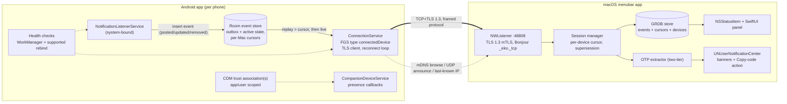

# Eko — Android notifications on your Mac

**Technical plan, v1.0 — 2026-07-24**

Eko is a macOS menubar app plus an Android companion app. The Android app captures notifications
on one or more phones and forwards them over the local Wi-Fi network to the Mac, where they are
shown live, can be copied, and — for 2FA/OTP messages — offer a one-click "copy code" action.

The two hard product requirements that drive every design decision below:

1. **Stable and self-healing.** When a phone drops off the network (Wi-Fi loss, Doze, process
   death, Mac asleep) and later reconnects, the Mac must recover every event committed to the
   phone's durable outbox. Retention loss is explicit, and evidence-backed periods in which the
   listener may have been unavailable are surfaced as suspected capture gaps.
2. **Multiple phones per Mac**, each independently paired, connected, and recoverable.

Later versions add Internet connectivity (outside the LAN) and screen sharing. v1 is LAN-only,
but the architecture leaves explicit seams for both (§13).

This plan is based on primary-source research (Android/Apple developer documentation, AOSP
source, KDE Connect/LocalSend/scrcpy source, issue trackers) done in July 2026. Sources are
listed per section in §16. Findings that must be re-verified on real hardware before they are
load-bearing are collected as explicit spikes in §14.

---

## Table of contents

1. [What the research says — constraints that shape the design](#1-what-the-research-says--constraints-that-shape-the-design)
2. [Goals and non-goals](#2-goals-and-non-goals)
3. [Locked-in decisions at a glance](#3-locked-in-decisions-at-a-glance)
4. [System architecture](#4-system-architecture)
5. [Android app](#5-android-app)
6. [macOS app](#6-macos-app)
7. [Discovery, pairing, and security](#7-discovery-pairing-and-security)
8. [Wire protocol](#8-wire-protocol)
9. [Store-and-forward: the self-healing core](#9-store-and-forward-the-self-healing-core)
10. [OTP / 2FA code extraction](#10-otp--2fa-code-extraction)
11. [UI design](#11-ui-design)
12. [Failure modes and recovery matrix](#12-failure-modes-and-recovery-matrix)
13. [Future features: Internet transport and screen sharing](#13-future-features-internet-transport-and-screen-sharing)
14. [Risks and early spikes](#14-risks-and-early-spikes)
15. [Roadmap, repo layout, testing](#15-roadmap-repo-layout-testing)
16. [Sources](#16-sources)

---

## 1. What the research says — constraints that shape the design

### 1.1 Android 15+ redacts OTP codes from notification listeners — the single biggest constraint

Since Android 15, Android System Intelligence classifies notifications containing 2FA/OTP codes
as "sensitive". An ordinary `NotificationListenerService` (NLS) still receives the notification
event, but its text is replaced with the system string *"Sensitive notification content
hidden"*. This silently breaks Eko's headline feature on Android 15/16 — it broke Microsoft
Phone Link's OTP mirroring too (only OEM-preinstalled system builds of Link to Windows got it
back), and KDE Connect tracks it as bug 495146 (closed RESOLVED UPSTREAM — i.e. unfixed
in-app, with the adb-appops and disable-Enhanced-notifications workarounds documented).

The gate is `android.permission.RECEIVE_SENSITIVE_NOTIFICATIONS` (protection level
`signature|role` — a normal app **cannot** request it). However, the AOSP trust check
(`NotificationManagerService.isAppTrustedNotificationListenerService()`, verified in AOSP main,
July 2026) treats a listener as trusted if **any** of these hold:

- it holds `RECEIVE_SENSITIVE_NOTIFICATIONS` (system/role apps only), or
- it is platform-signed, or
- the `RECEIVE_SENSITIVE_NOTIFICATIONS` app-op was granted (adb workaround), or
- **the package has any non-revoked `CompanionDeviceManager` (CDM) association for the user —
  any profile, including a plain profile-less association, which any third-party app can
  create freely.**

**Critical timing subtlety** (verified in AOSP, load-bearing for our flows): the redaction
decision at post time does not call `isAppTrustedNotificationListenerService()` directly — it
reads a **cached trust set** populated only at listener-bind time (`onServiceAddedLocked` and
the NLS access toggle; NMS deliberately does not listen for CDM changes). So a CDM association
created *while the listener is already bound* does not lift redaction until the listener
rebinds — which is exactly our second-Mac case and any onboarding where notification access is
granted before pairing. Eko therefore performs the supported §5.3.6 rebind sequence after every
association-state change: if connected, call instance `requestUnbind()`, wait for
`onListenerDisconnected()`, then call static `requestRebind(ComponentName)`; if already
disconnected, call `requestRebind()` directly. It never toggles the component. Spike S2 tests
both orderings (associate-then-bind and bind-then-associate).

**Design consequence:** the Android app must establish at least one CDM association for its
user before the OTP feature is advertised as working. Trust is package/user-wide, not scoped to
a Mac pairing: any non-revoked association trusts the listener, so association records are
modeled independently and at least one is retained while any Mac remains paired. Eko may create
additional BLE associations for per-device presence, but never treats an association id as a
pairing id. Eko is distributed by **sideloading only** (no Play Store — §5.5), so store policy
never constrains us, but CDM is still the primary path: it is the only route that needs neither
adb nor a settings change, and it also buys background-execution exemptions (§5.3). Sideloading
widens the fallback menu, in order of
preference: (a) profile-less CDM association (default — zero friction beyond one system
dialog), (b) watch-profile association (`DEVICE_PROFILE_WATCH` via
`REQUEST_COMPANION_PROFILE_WATCH`, a normal permission), which grants the
`COMPANION_DEVICE_WATCH` role and with it `RECEIVE_SENSITIVE_NOTIFICATIONS` outright —
evaluate in spike S1, (c) a documented one-time adb app-op grant
(`appops set <pkg> RECEIVE_SENSITIVE_NOTIFICATIONS allow`), (d) disabling "Enhanced
notifications" (turns off OTP classification system-wide). Do **not** design around
`DEVICE_PROFILE_COMPUTER` or self-managed associations — the required permissions are
`signature|privileged` and unavailable even to sideloaded apps.

### 1.2 Nobody does store-and-forward — recovery must be event-sourced on the phone

Verified against source: KDE Connect has **no** store-and-forward. On reconnect the desktop
sends `{"request": true}` and the phone replays only `getActiveNotifications()` — notifications
still sitting in the status bar. Anything posted *and dismissed* while the desktop was offline
(exactly the lifecycle of an OTP) is lost forever. Pushbullet's mirroring "ephemerals" are
explicitly not stored; Join rides on FCM, which caps offline queues at 100 non-collapsible
messages and drops all of them on overflow.

**Design consequence:** the phone serializes every delivered notification callback through one
writer and transactionally updates a local SQLite outbox plus its durable active-notification
state. An event becomes *captured* only when that transaction commits and is never eligible to
send before then. The shared log has a per-device monotonic sequence; each Mac resumes from its
own durable cursor. `getActiveNotifications()` is only a reconciliation input, never the
recovery mechanism. This is genuinely novel in this product space and architecturally cheap
(§9).

### 1.3 Android will kill the app; correctness must not depend on the process surviving

Doze, App Standby Buckets, and above all OEM battery managers (Samsung sleeps "unused" apps
after 3 days; Huawei's PowerGenie kills non-whitelisted apps outright; Xiaomi requires an
Autostart permission; dontkillmyapp.com documents "no known dev-side solution" for several)
will kill the connection service no matter what we do. Mitigations exist (foreground service of
type `connectedDevice`, CDM exemptions, per-OEM user guidance) and are all in §5.3 — but the
architecture treats process death as *routine*: the durable outbox means a killed app loses the
connection, never the data.

### 1.4 The Mac must be the server, the phone the client

An Android *listening* socket dies with the process and nothing external can restart the app on
an incoming LAN connection. The reverse direction is robust: the Mac runs a persistent
`NWListener`; the phone knows its own connectivity (`ConnectivityManager` callbacks) and
reconnects from its foreground service. Bonus (Apple TN3179, verified): on macOS 15+ *accepting
incoming TCP connections requires no Local Network permission* — the permission gates all
Bonjour operations (register/browse/resolve) and all *outgoing* local-network traffic,
including our UDP announce broadcasts — so the core data path (phone dials in) keeps working
even if the user denies the prompt; only Mac-initiated discovery degrades.

### 1.5 Discovery is a hint, never an authority

UDP broadcast fails on AP-isolated/guest/mesh networks; mDNS is filtered on others and on some
Wi-Fi chips unless a `MulticastLock` is held (which drains battery if held permanently).
"Devices can't see each other" is KDE Connect's #1 support ticket. Eko therefore layers four
discovery mechanisms (mDNS, UDP announce, last-known-IP dialing, manual/QR entry) and treats
all of them purely as *connection hints* — only the authenticated TLS session defines
online/offline, and only pinned certificates define identity (§7).

---

## 2. Goals and non-goals

### v1 goals

- Mirror notifications from N Android phones to one Mac over the same Wi-Fi network, live.
- Menubar UI: browse, search, copy notification text; per-app filters; per-device grouping.
- Native macOS notification banners with a "Copy code" action for detected OTPs.
- One-click (opt-in: automatic) extraction of 2FA codes, robust across languages and formats.
- Store-and-forward: **zero loss of committed outbox events** across Wi-Fi drops, Doze, process
  death, Mac sleep, and reboots, bounded by an explicit retention window (48 h / 2'000 events
  per Mac), with an honest gap indicator when retention is exceeded. Callback inputs queued but
  not yet committed can be lost with the process. Listener-dead intervals are unrecoverable and
  cannot always be detected; Eko surfaces evidence-backed intervals as *suspected* capture gaps
  rather than claiming silence proves loss.
- v1 renders notification text plus app label only; app icons and images ride the reserved
  binary frame type in v1.x.
- UI strings externalized from day one; v1 ships English + German (Swiss formatting per the
  panel's locale conventions).
- Mirror dismissals both ways (dismiss on Mac → dismissed on phone, and vice versa).
- Pairing that a non-technical user can complete, with a security model an expert can audit.
- Survive Android 15/16 OTP redaction via CDM association; survive macOS 15+ local-network
  privacy; ready for Android 17's `ACCESS_LOCAL_NETWORK` runtime permission.

### v1 non-goals (explicitly deferred)

- Internet/remote connectivity (v2 — but the protocol is transport-agnostic from day one).
- Screen sharing/mirroring (v3 — MediaProjection + WebRTC; seams reserved in the protocol).
- Notification *actions* beyond dismiss (inline reply etc. — protocol reserves fields).
- SMS-specific features (sending SMS, call log). Sideloading would permit the permissions, but
  NLS already covers SMS notifications; direct `READ_SMS` capture stays a possible v1.x opt-in
  module (§5.5), not v1 scope.
- iOS, Windows, Linux.
- **Google Play distribution** — Eko is sideload-only by design (§5.5). Play policy
  considerations in this document are historical context, not constraints.
- Mac App Store distribution (Developer ID first; sandbox on from day one so MAS stays open).

---

## 3. Locked-in decisions at a glance

| # | Decision | Why (short) |
|---|----------|-------------|
| D1 | Phone = TCP/TLS **client**, Mac = **server** (`NWListener`, fixed port, default 48808) | Android can't hold a listening socket in background; macOS 15 doesn't gate incoming TCP (§1.4) |
| D2 | Transport: TCP + **TLS 1.3, mutual auth**, 4-byte length-prefixed frames, 1-byte frame type (JSON control/events now; binary type reserved) | Simplest robust option; QUIC/gRPC add complexity with no v1 payoff; binary frame type future-proofs icons/media |
| D3 | Identity = per-device long-lived **self-signed P-256 cert**; deviceId = SHA-256 fingerprint; TOFU pinning at pairing; commit-then-reveal verification code | KDE Connect model, hardened with the CVE-2025-66270 lesson (identity claims only count post-TLS) and a ZRTP-style commitment so the short code isn't grindable (§7.2) |
| D4 | **Phone-side durable event store** (Room/SQLite, WAL, runtime-verified `synchronous=FULL`); a transactional metadata high-water allocates the per-**device** sequence, consumed by all pairings against per-pairing cursors | The self-healing core; makes sequence allocation, active state, and retention gaps explicit (§9) |
| D5 | **App/user-scoped CDM trust associations**, independent of Mac pairing rows (profile-less or watch-profile; BLE Mac preferred, Wi-Fi AP fallback) | Any non-revoked association trusts the package; BLE presence can improve Android 16 latency, while one retained association keeps OTP trust for all pairings (§1.1, §5.3) |
| D6 | Android foreground service type **`connectedDevice`** (never `dataSync`) | No timeout; legal to start from `BOOT_COMPLETED`; `dataSync` has a 6 h/24 h hard limit on Android 15 |
| D7 | OTP extraction runs **on the Mac**, two-tier (deterministic standards first, keyword-gated heuristics second) | Rules iterate with a Mac-app update alone (no phone-side APK rollout); backlog can be re-scanned retroactively; single Swift test corpus |
| D8 | macOS UI: **AppKit `NSStatusItem` + custom panel hosting SwiftUI** (`NSHostingView`); min target macOS 14 | SwiftUI `MenuBarExtra` still lacks presentation-state/window APIs as of Xcode 26; `.menu` style can't host a live feed |
| D9 | Mac persistence: **GRDB 7** (SQLite, WAL, `ValueObservation`); identity key in data-protection Keychain; peer certs in DB | Substantially faster than SwiftData on bulk inserts and reactive UI queries; bounded indexed `LIKE` search ships in v1, with FTS5 as an optimization later |
| D10 | Distribution: **Developer ID + notarization** on macOS, sandbox enabled from day one; **sideloaded APK** on Android (GitHub Releases + in-app update check / Obtainium) | macOS 15 removed the Gatekeeper ctrl-click bypass; sideload-only Android distribution frees the design from Play policy (§5.5) |
| D11 | Discovery: mDNS/Bonjour (`_eko._tcp`) + UDP announce (port 48809) + last-known-IP dial + QR/manual — hints only | Every single mechanism fails on some real network (§1.5) |
| D12 | App-level heartbeat while CPU/network are available (phone target 25 s, hard-close after a 10 s pong deadline; Mac target 90 s) + full-jitter backoff capped at 60 s | Detects half-open sockets promptly while awake; Doze may suspend both timing and network, so these are latency targets, never recovery bounds |

---

## 4. System architecture



Each paired phone is an independent unit on the Mac: its own pinned certificate, session,
cursor, backlog state, and UI section. Nothing is shared between phones except the listener
socket and the database.

Both apps are built around one shared, versioned protocol spec (`/protocol` in the repo) with
language-neutral test vectors consumed by both the Kotlin and Swift test suites.

---

## 5. Android app

### 5.1 Components

| Component | Type | Responsibility |
|-----------|------|----------------|
| `EkoNotificationListener` | `NotificationListenerService` | Receive callbacks on the service main thread; hand them off in order to one bounded writer actor; transactionally update outbox + durable active state; detect redaction; reconcile via `getActiveNotifications()` on (re)connect. Callback return is not a durability boundary; only a committed transaction is "captured" |
| `ConnectionService` | Foreground service, `foregroundServiceType="connectedDevice"` | Own the TLS client sockets (one per paired Mac), reconnect loop, heartbeats, outbox drain, ack handling |
| Event store | Room/SQLite (WAL) | Durable event log, sequence/generation metadata, active-notification state, pairing cursors/floors, and explicit gap spans (§9) |
| `PairingManager` | Activity flow + CDM | Discovery UI, QR scan, TOFU cert exchange, verification code, CDM `associate()` |
| `EkoCompanionDeviceService` | Exported `CompanionDeviceService`, guarded by `BIND_COMPANION_DEVICE_SERVICE` | Receive CDM presence callbacks used for optional Android 16 reliability mode |
| Health coordinator | WorkManager (15 min, best effort) + lifecycle/network triggers | Check listener/access state, inspect process-exit evidence, run supported unbind/rebind recovery, and request connection restart when Android permits |
| Receivers | `BOOT_COMPLETED`, `MY_PACKAGE_REPLACED`, connectivity callbacks | Restart `ConnectionService`; trigger immediate reconnect on network change |
| Settings/Onboarding UI | Jetpack Compose | Permission checklist, per-app forwarding rules, OEM reliability guide, diagnostics |

Stack: Kotlin, coroutines/Flow, Room, Jetpack Compose, **`minSdk 26`, `compileSdk 36`, and
`targetSdk 36`** for v1. No Firebase dependency in v1 (LAN-only; FCM arrives with v2). TLS via the
platform `SSLSocket` with a custom pin-checking `X509TrustManager` — no OkHttp needed for a
raw socket protocol, no Netty. **Platform TLS 1.3 exists only on API 29+**; since the Mac
enforces TLS 1.3 with no downgrade path, the app bundles the standalone Conscrypt provider
(`org.conscrypt:conscrypt-android`) on API 26–28 to get TLS 1.3 everywhere. (If Android 8/9
usage proves negligible, drop the dependency and raise minSdk to 29 instead.) The trust manager
compares the peer's exact DER/fingerprint against a confirmed pin (or restricted revocation
tombstone) and does not perform DNS endpoint identification for raw IP connections.

### 5.2 Notification capture details

- Manifest service guarded by `android.permission.BIND_NOTIFICATION_LISTENER_SERVICE` with the
  `android.service.notification.NotificationListenerService` intent-filter action;
  `android:exported="false"`.
- Grant flow deep-links to the app's own row:
  `Settings.ACTION_NOTIFICATION_LISTENER_DETAIL_SETTINGS` +
  `EXTRA_NOTIFICATION_LISTENER_COMPONENT_NAME` (API 30+; fall back to the generic listener
  settings screen below that). Poll state with
  `NotificationManager.isNotificationListenerAccessGranted(ComponentName)` (API 27+; on
  API 26 parse `Settings.Secure` `enabled_notification_listeners` /
  `NotificationManagerCompat.getEnabledListenerPackages()`).
- On Android 13+, sideloaded installs can have notification-listener access blocked until the
  user opens App info, chooses the overflow menu, and enables **Allow restricted settings**.
  There is no reliable public preflight API, so the install guide shows this conditional step
  before notification access and troubleshooting infers it when access remains unavailable.
- Extract per event: `getKey()` (opaque identity — never parsed), package, post time,
  `EXTRA_TITLE`, `EXTRA_TEXT`, `EXTRA_BIG_TEXT`, `EXTRA_SUB_TEXT`, `EXTRA_INFO_TEXT`,
  `EXTRA_SUMMARY_TEXT`, `EXTRA_TEXT_LINES`, MessagingStyle messages
  (`NotificationCompat.MessagingStyle.extractMessagingStyleFromNotification`) — each extra as a
  **separate structured field** so the Mac-side extractor has full context; app label resolved
  locally; category; `isClearable`; group key + `FLAG_GROUP_SUMMARY`.
- Skip `FLAG_ONGOING_EVENT`/`FLAG_FOREGROUND_SERVICE` notifications by default (media players,
  navigation, our own FGS notification) — configurable per app.
- Never capture Eko's own package at all: the ongoing-skip covers the FGS notification, but
  mirroring our own pairing/repair alerts would be noise (and an OTP false-positive source).
- `onNotificationRemoved` forwards the `REASON_*` code so the Mac can distinguish user dismissal
  (mirror it) from app-side cancel and from our own `cancelNotification()` round-trips.
- Mac-initiated dismissal: `cancelNotification(key)`.
- On `onListenerConnected`: obtain `getActiveNotifications()` and enqueue one reconciliation
  command behind prior callbacks on the writer actor. Its transaction diffs the snapshot against
  `active_notification`, synthesizes `removed` rows for vanished keys (`reason = RECONCILED`) and
  `posted` rows for newly visible keys, and updates active state. Connection replay starts only
  after that transaction commits. Still-active notifications are recoverable; posted-and-
  dismissed ones are not, and only lifecycle/process evidence can justify a suspected
  `capture_gap` (§9).
- **Work profiles / multiple users:** Android ignores an NLS installed inside a managed work
  profile, so onboarding refuses that configuration and directs the user to install Eko in the
  personal profile. A personal-profile listener receives work notifications only when the DPC
  permits cross-profile notification listeners; absence of callbacks cannot prove an admin
  block. For events Android does deliver, carry `sbn.getUser()` and key rules on
  `(package, user)`. Resolve work labels/icons best effort and fall back to package name when
  cross-profile lookup is denied. Test this with TestDPC plus physical managed devices (§15).
- **Do Not Disturb parity:** forward the phone's interruption filter
  (`getCurrentInterruptionFilter` / `onInterruptionFilterChanged`) and per-notification DND
  suppression as metadata. Default Mac behavior while phone DND is active: mirror silently to
  the panel, no banner (user-configurable) — the Mac must not ring for what the phone
  deliberately silenced.
- **Redaction self-check:** compare incoming text against the system string
  `redacted_notification_message` (`Resources.getSystem().getIdentifier(...)`). If detected, the
  CDM trust path is broken (association revoked, OEM quirk) — surface a repair card in the app
  and a warning on the Mac instead of silently forwarding "Sensitive notification content
  hidden".

Android 12/API 31+ listener filtering metadata (`default_filter_types`) is set to
conversations|alerting|silent (ongoing excluded) — an optimization only; correctness never
depends on it (the metadata originated in API 31).

### 5.3 Background survival strategy (layered, in order of importance)

1. **The event store, not the process, guarantees delivery of committed events** (§9).
   Everything below improves latency and the probability that Android delivers and Eko commits
   each callback. No watchdog can prove or bound every listener-dead interval; evidence-backed
   suspected gaps are surfaced honestly and committed rows are never lost silently.
2. **NLS binding itself.** The system binds enabled listeners with
   `BIND_AUTO_CREATE | BIND_FOREGROUND_SERVICE` (verified in AOSP `ManagedServices`, with a
   ~10 s rebind-on-death), which raises process importance and normally recreates the listener
   after an ordinary kill. `BIND_FOREGROUND_SERVICE` does **not** place the UID on the Doze
   power allowlist and does not preserve LAN sockets in deep idle. A Settings force-stop leaves
   the package stopped (no rebind or receivers) until explicit user interaction; OEM kills can
   also create uncertain capture intervals.
3. **Foreground service** `connectedDevice` (requires `FOREGROUND_SERVICE` +
   `FOREGROUND_SERVICE_CONNECTED_DEVICE`; prerequisite satisfied via `CHANGE_WIFI_STATE` /
   `CHANGE_WIFI_MULTICAST_STATE`, both normal). **No timeout**, unlike `dataSync` (hard
   6 h/24 h limit on Android 15+ and banned from `BOOT_COMPLETED` starts). Return
   `START_STICKY`; request starts from `BOOT_COMPLETED` / `MY_PACKAGE_REPLACED` receivers and
   lifecycle/network triggers, catching
   `ForegroundServiceStartNotAllowedException` (KDE Connect pattern). (Sideload-only: the Play
   Console FGS-type declaration/demo-video requirement does not apply to us.) An FGS improves
   process priority but does not bypass Doze network suspension; `POST_NOTIFICATIONS` denial
   does not prevent the service from starting.
4. **CDM trust/presence associations** (also required for OTPs, §1.1 — including the
   post-mutation rebind, since listener trust is cached at bind time): with manifest-declared
   `REQUEST_COMPANION_RUN_IN_BACKGROUND` + `REQUEST_COMPANION_USE_DATA_IN_BACKGROUND` +
   `REQUEST_COMPANION_START_FOREGROUND_SERVICES_FROM_BACKGROUND` (all `normal`; the last is
   the documented preferred exemption for eligible background FGS starts on
   Android 12+), an active association puts the app on the **permanent Doze power allowlist on
   Android 12–15** and exempts it from the restricted standby bucket and permission auto-revoke.
   On **Android 16 the power-allowlist exemption became presence-gated** (BLE/BT appear events
   only; Wi-Fi devices explicitly unsupported for presence). Hence the Mac advertises a BLE
   peripheral (§7.2), the app calls the API-appropriate `startObservingDevicePresence` overload
   for that association, and the
   manifest includes the exported, permission-guarded `CompanionDeviceService` from §5.1. The
   *redaction-trust* benefit is app/user-wide and not presence-gated. If presence observation is
   off on Android 16, idle connectivity is best effort unless the user grants the separate
   battery-optimization exemption.
5. **Reconnect triggers**, in priority order: `ConnectivityManager.registerNetworkCallback`
   (TRANSPORT_WIFI/ETHERNET/VPN only — never cellular in v1) → cached last-known Mac IP:port
   dial → short mDNS scan windows holding `MulticastLock` only while scanning → WorkManager
   15-min periodic reconcile (eligible in maintenance windows) → an optional
   `AlarmManager.setAndAllowWhileIdle` health tick (throttled to roughly one per nine minutes in
   Doze). Network callbacks, WorkManager, alarms, an FGS, and wake locks do not provide a bounded
   reconnect deadline in deep idle; replay after wake is the correctness mechanism.
6. **NLS health and supported rebind.** Track access state, `onListenerConnected`/
   `onListenerDisconnected`, writer-queue overflow, and `ApplicationExitInfo` on the next start.
   `ApplicationExitInfo` is API 30+; older releases have no equivalent process-exit evidence.
   Notification silence, even while screen-on, is diagnostic context only and never proof of a
   stall. If access is granted but this process has not connected after a grace period, call
   static `requestRebind(ComponentName)`. For an explicit repair while connected, call instance
   `requestUnbind()`, wait for disconnect, then call static `requestRebind()`. If it still does
   not reconnect, show a card asking the user to toggle notification access off/on. Never
   disable/enable the component as a kick.
7. **Battery-optimization exemption:** rely on CDM first (it grants the real Doze allowlist on
   Android 12–15 silently). Additionally — since sideload-only distribution removes the Play
   policy risk that burned Syncthing-Android (#1039) — the onboarding checklist directly
   requests the exemption via `ACTION_REQUEST_IGNORE_BATTERY_OPTIMIZATIONS`
   (`REQUEST_IGNORE_BATTERY_OPTIMIZATIONS` permission) as an optional "maximum reliability"
   step, with the `ACTION_IGNORE_BATTERY_OPTIMIZATION_SETTINGS` deep-link as manual fallback.
   State is checked via `PowerManager.isIgnoringBatteryOptimizations()`.
8. **OEM reliability guide** keyed on `Build.MANUFACTURER` (Samsung: never-sleeping apps +
   disable 3-day auto-sleep; Xiaomi/HyperOS: Autostart + battery "No restrictions" + lock in
   recents; Huawei: manual app-launch, PowerGenie caveat; OnePlus: disable optimization), with
   links to dontkillmyapp.com. Shown during onboarding and re-surfaced only from concrete health
   evidence (disconnect callbacks, process-exit reason, repeated FGS-start denial, or committed-
   but-unsent backlog growth). Post/forward timestamp silence alone does not prove an OEM kill.
9. **User-visible honesty:** on supported Android releases the user can dismiss the FGS
   notification without stopping the service. Task Manager Stop terminates the app but delivers
   no callback, so the Mac can show only "disconnected", not a definitive paused state. On the
   next start inspect `ApplicationExitInfo.REASON_USER_REQUESTED`; if present, persist a paused
   forwarding state and require an explicit in-app Resume before restarting the FGS. Explain what
   happened instead of fighting the user's action with a background restart loop.
10. **Eko's own battery cost is a budgeted, measured quantity** — survival isn't the only
   battery concern; excess drain is the #1 uninstall driver for companion apps. Budget:
   **< 2 %/day attributed drain** on a Pixel-class device. Measurement: a 24 h Battery
   Historian / `BatteryStats` soak on Pixel + one OEM device is an M3 gate (§15). The 25 s
   heartbeat (§8) is a tunable; the planned mitigation if the budget is missed is screen-off/
   Doze-aware relaxation of ping cadence. Both endpoints' deadlines pause in deep idle. BLE
   presence stays opt-in as Android 16 reliability mode, with UI explaining that disabling it
   also gives up the CDM presence-gated Doze exemption.

### 5.4 Android permissions inventory

Sideload-only distribution means no store policy gates any of these — the constraint on each
choice is purely OS behavior and user trust (ask for the minimum, explain every prompt).

| Permission / access | Kind | Purpose |
|---|---|---|
| Notification access (NLS) | Special access, user toggle | Capture notifications (prominent in-app disclosure stays — good practice, not policy) |
| `POST_NOTIFICATIONS` | Runtime | Makes FGS status and alerts visible in the notification drawer; denial does not prevent FGS start |
| `FOREGROUND_SERVICE`, `FOREGROUND_SERVICE_CONNECTED_DEVICE` | Normal | Connection service |
| `RECEIVE_BOOT_COMPLETED` | Normal | Restart after reboot |
| `INTERNET`, `ACCESS_NETWORK_STATE`, `CHANGE_WIFI_STATE`, `CHANGE_WIFI_MULTICAST_STATE` | Normal | Sockets, network callbacks, mDNS multicast lock, FGS prerequisite |
| `REQUEST_COMPANION_RUN_IN_BACKGROUND`, `REQUEST_COMPANION_USE_DATA_IN_BACKGROUND`, `REQUEST_COMPANION_START_FOREGROUND_SERVICES_FROM_BACKGROUND`, `REQUEST_OBSERVE_COMPANION_DEVICE_PRESENCE` | Normal | CDM exemptions, background FGS restarts, presence |
| `REQUEST_COMPANION_PROFILE_WATCH` | Normal | Watch-profile CDM association, if S1 lands on it |
| `REQUEST_IGNORE_BATTERY_OPTIMIZATIONS` | Normal (dialog on request) | Optional "maximum reliability" onboarding step (§5.3.7) |
| `REQUEST_INSTALL_PACKAGES` | Special access | In-app self-update (§5.5); optional — omitted when the user updates via Obtainium |
| `CAMERA` | Runtime, optional | QR pairing only |

Deliberately **not** used in v1: `READ_SMS`/`RECEIVE_SMS` — sideloading would allow them, but
NLS already covers SMS via the default SMS app's notifications; a direct-SMS capture module
(immune to notification redaction and NLS flakiness) is a possible v1.x opt-in (§5.5).
Also not used: `BLUETOOTH_SCAN`/`BLUETOOTH_CONNECT` — CDM performs the BLE scan on the app's
behalf (no scan permission, no location dependency); they'd only be needed if S1 finds we must
`createBond()` for resolvable-address tracking, in which case declare `BLUETOOTH_SCAN` with
`android:usesPermissionFlags="neverForLocation"`. Also not used: `QUERY_ALL_PACKAGES` (app
labels come from the notifying package only), `SYSTEM_ALERT_WINDOW`, exact-alarm permissions,
Accessibility. Because v1 targets API 36, it also does **not** declare
`ACCESS_LOCAL_NETWORK`; Android 17 guidance says targets 36 and lower should omit it. A future
target-37 migration must declare/request it before discovery or any LAN socket and fully support
denial.

`BIND_COMPANION_DEVICE_SERVICE` is not requested by Eko. It is a system-only binding permission
placed on the exported `EkoCompanionDeviceService` manifest declaration so only Android can bind
the presence service.

Device-state prerequisite worth its own onboarding check: **CDM discovery requires device
Location Services to be enabled** (system-level, distinct from app location permissions) —
with it off, the CDM picker finds nothing for both BLE and Wi-Fi filters. Precheck via
`LocationManager.isLocationEnabled()` with a deep link to location settings (§11.3).

### 5.5 Distribution and updates (sideload-only)

- **Channel:** signed APK on GitHub Releases (universal APK; split ABIs only if size ever
  matters). No Play Store, no Play App Signing — **we hold the one signing key**, and it must
  never rotate casually: a key change forces uninstall/reinstall, which wipes the outbox,
  notification-access grant, CDM associations, and changes the app's uid (invalidating stored
  notification keys). Back the keystore up like a production secret.
- **Updates:** two supported paths — (a) recommend **Obtainium** (points at the GitHub repo,
  handles update checks and installs; zero code on our side), and (b) a built-in lightweight
  update check against the GitHub Releases API with in-app download + install prompt
  (`REQUEST_INSTALL_PACKAGES`). The in-app updater is a v1.x nicety; v1.0 ships with a "new
  version available" notice + link.
- **Install friction is an onboarding concern:** first-time sideloading requires the user to
  allow "Install unknown apps" for their browser/file manager. On Android 13+, notification
  access can additionally require App info → overflow → **Allow restricted settings**. The
  Mac-side wizard's QR-linked guide covers both, with screenshots per Android version and
  installer.
- **Developer verification:** per the July 2026 FAQ, direct GitHub/Obtainium sideloading is
  outside the initial September 30, 2026 enforcement phase, but broader rollout begins in 2027.
  Before that rollout, register the package name and release signing certificate in Android
  Developer Console (full distribution if installs are offered broadly). This is a release-
  operations gate and another reason the signing key cannot rotate casually.
- **targetSdk policy:** v1 is pinned to API 36. Track Android 17/API 37 in CI, but adopt target 37
  only together with the complete `ACCESS_LOCAL_NETWORK` permission/denial flow; never leave the
  manifest in a half-migrated state.
- **Crash/diagnostics telemetry stays opt-in and local-first** (export-a-file diagnostics
  before any network telemetry); sideload users self-select for privacy sensitivity.

### 5.6 Keys, backup, and data handling

Notification bodies (including OTPs) are the payload — treat both stores as sensitive:

- **Android identity key** lives in the **Android Keystore** (non-exportable), fed to the
  socket via a custom `KeyManager`; the self-signed cert is stored alongside as app data.
  Peer pins, endpoints, pending/revoked pairing state, and the per-install `conn_epoch` live in a
  small identity store outside the replaceable event DB. If the event DB must be recreated, its
  pairing cursor rows are rehydrated from this store under a fresh generation, so known peers can
  authenticate and receive an explicit generation transition. Cross-store pairing completion is
  an idempotent pending-state workflow, not an assumed atomic transaction.
- **Backup exclusion is mandatory:** with default Auto Backup, Google's cloud backup would
  upload app data — a restore onto another device would clone the identity and leak the
  outbox (full text of OTP messages). Ship `android:dataExtractionRules`/
  `android:fullBackupContent` rules excluding the outbox DB and all key/cert material.
  (Keystore keys don't back up, but the exclusion also protects the outbox and prevents the
  restored-DB sequence-regression hazard, §9.) Device-to-device migration is treated as a new
  install: new identity, guided re-pair.
- **Mac at-rest posture (v1):** the GRDB store lives in the app-sandbox container; rely on
  FileVault and document that plainly. Encrypting OTP payload columns at rest is a v1.x
  hardening option, not v1 scope.
- **Deletion on unpair:** while connected, send `unpair`, wait for an idempotent acknowledgement,
  then delete. An offline local unpair immediately deletes history/cursors and blocks normal
  traffic, but retains the peer fingerprint as a minimal `revoked_pending` tombstone. A
  phone-side tombstone also retains the last Mac endpoint and makes bounded unpair-only dials;
  a Mac-side tombstone waits for the phone's next connection. Exact-cert TLS is admitted only to
  exchange `unpair`/ack and is then closed; no notification data is accepted or disclosed. The
  phone removes only a CDM association that no remaining Mac pairing relies on. Delete the
  tombstone after acknowledgement (or an explicit "forget without notifying" user action).
  This is the only way "propagated on next contact" can work after local revocation.
- **Data-handling statement (user-facing, shipped in /docs and both apps):** v1 is
  device-to-device only — zero third-party traffic, no accounts, no telemetry by default;
  retention is 48 h/2'000 events on the phone, 7 d/5'000 per device on the Mac (configurable);
  diagnostics exports are local files with notification content redacted unless the user opts
  in per export.
- **Store migrations:** Room and GRDB schemas are versioned from v1.0, forward-only
  migrations, with CI migration-fixture tests (old DB → current). Outbox payload JSON is
  versioned by the protocol version that wrote it; old rows replay in their original shape
  (receivers must-ignore unknown/missing optional fields, §8).

---

## 6. macOS app

### 6.1 Shell and lifecycle

- `LSUIElement = true` (accessory app, no Dock icon). Menubar presence via **`NSStatusItem`**
  with a custom **`NSPanel`** hosting SwiftUI content through `NSHostingView` (D8). SwiftUI
  `MenuBarExtra` is not usable: `.menu` style blocks the run loop and can't host live views;
  `.window` style still has no API for presentation state, the status item, or the panel window
  as of Xcode 26 (would force the MenuBarExtraAccess introspection hack), plus known
  `SettingsLink`/`openSettings` breakage. The panel subclass can become key for keyboard access;
  settings uses a retained `NSWindowController` and activates the accessory app without changing
  activation policy (avoiding a transient Dock icon and menu-bar flicker).
- Minimum target **macOS 14 Sonoma** (13 is EOL; 14/15/26 receive security updates; macOS 27 is
  Apple-Silicon-only and ships fall 2026).
- Launch at login via `SMAppService.mainApp.register()`, handling `.requiresApproval` with
  `SMAppService.openSystemSettingsLoginItems()`. Registration fails with error 78 outside
  /Applications — onboarding checks the app's location.
- Fully event-driven for energy: Network.framework state/viability/path handlers +
  `NWPathMonitor`; kernel TCP keepalive; **no periodic network/UI-state polling**. Protocol
  deadlines, one-shot clipboard/badge expiry tasks, and a visibility-scoped relative-time update
  while the panel is open are allowed. App Nap is acceptable — incoming socket data wakes the
  process. `NSBackgroundActivityScheduler` handles DB pruning.

### 6.2 Networking

- One `NWListener` on a fixed, persisted TCP port (default **48808**, falling back to a random
  port with a user-visible notice on bind failure — LocalSend's fixed-port collisions taught
  this), bound to the wildcard address so DHCP/interface changes don't invalidate it.
- TLS 1.3 minimum, mutual authentication:
  `sec_protocol_options_set_local_identity` (identity from the data-protection Keychain),
  `set_peer_authentication_required(true)`, and a verify block that copies the presented leaf DER
  and compares it byte-for-byte with the peer pin. `SecTrustSetAnchorCertificates` may be used for
  additional certificate-profile/date evaluation but **never** defines pin equality (an anchor
  can otherwise validate descendants). Pairing mode accepts one unknown leaf only into the
  bounded TOFU state machine. After TLS becomes ready, `hello.device_id` must equal the lowercase
  64-hex SHA-256 of that same leaf. Endpoint/hostname validation is disabled because connections
  normally use IP addresses and self-signed certs.
- The raw TCP `NWListener` is started without an attached Bonjour service. A separate
  `NetService`/DNS-SD publisher advertises `_eko._tcp` and the listener's actual bound port with a
  TXT record carrying the cert fingerprint and protocol version hint. This keeps Bonjour policy
  denial from changing listener readiness. Info.plist ships `NSLocalNetworkUsageDescription` and
  `NSBonjourServices` (macOS 15 requirement). Denial is a **first-class degraded state**, not an
  error: Bonjour ops stick in `.waiting` with `kDNSServiceErr_PolicyDenied` (-65570) /
  `unsatisfiedReason == .localNetworkDenied` — the UI shows "Local Network access is off —
  discovery disabled; direct connections still work" with a deep link to System Settings.
  The system auto-retries after grant; never treat `.waiting` as fatal. There is **no way to
  reset this privilege** for testing except VM snapshots/fresh users — plan QA accordingly.
- App Sandbox on from day one: `com.apple.security.network.server` + `.network.client`.
  (There is no `network.local` entitlement — that's folklore.)
- Listener hardening (the threat model's DoS scope includes the TCP listener, §7.1): cap
  concurrent unauthenticated connections, rate-limit connection attempts per source address,
  and time out the TLS+hello phase (~10 s) so floods of idle half-open sockets can't exhaust
  the session table.
- BLE peripheral advertisement via CoreBluetooth (`CBPeripheralManager`) with a fixed Eko
  service UUID — solely so phones can CDM-associate and observe presence (§5.3, §7.2).
  This needs the `com.apple.security.device.bluetooth` sandbox entitlement,
  `NSBluetoothAlwaysUsageDescription` in Info.plist, and a Bluetooth TCC grant — "Bluetooth
  denied on Mac" is another first-class degraded state (pairing falls back to the Wi-Fi-AP CDM
  association, mirroring S1's fallback; notification mirroring itself is unaffected).

### 6.3 Storage and secrets

- **GRDB 7** (`DatabasePool`, WAL). Tables: `device` (id = cert fingerprint, name, pinned cert
  DER, current generation + `processed_through_seq`, last IP, capabilities), `event` (device,
  generation, seq, kind, notification key,
  payload JSON, received_at), `gap_span` (device, generation, seq/time bounds, reason,
  confidence), `notification` (materialized current state per generation/key with
  `last_state_seq` — what
  the UI lists), and
  `otp` (extracted codes linked to notifications). The materialized row includes normalized,
  indexed `search_text` for bounded v1 search. `ValueObservation` drives the SwiftUI
  panel reactively. Unique `(device_id, outbox_gen, seq)` enforces idempotent ingest — the
  generation must be part of the key, because a sequence-space reset (§8) restarts the phone's
  seqs at low values that would otherwise collide with stored old-generation rows and be
  silently dropped as duplicates.
- Mac identity: generate the P-256 key once with `SecKeyCreateRandomKey`, permanent,
  non-synchronizable, non-exportable, and `ThisDeviceOnly` in the **data-protection keychain**
  (`kSecUseDataProtectionKeychain: true` on every call). Build the self-signed certificate once
  with Apple's `swift-certificates`, add it beside the matching private key, query the resulting
  `SecIdentity`, and bridge that identity with `sec_identity_create` for Network.framework.
  Restarts retrieve the same `SecIdentity`; regenerating only the certificate is forbidden because
  changed DER changes `deviceId`. Peer certificates are public data and live in GRDB, not Keychain.
- History retention: default 7 days / 5'000 notifications per device on the Mac (independent of
  the phone-side 48 h outbox), user-configurable; OTP clipboard handling in §10.

### 6.4 Native notifications

- `UNUserNotificationCenter` with `.provisional` authorization initially (quiet delivery),
  upgrade prompt in onboarding. **Signed builds only** — unsigned/ad-hoc builds silently fail to
  prompt and to post (and break local-network TCC tracking); dev builds are Developer
  ID-signed too. Verify accessory-app delivery in the first spike (one forum thread claims
  `LSUIElement` suppresses notifications; evidence points to AppleScript applets, but confirm).
- OTP notifications use a `UNNotificationCategory` with a **non-`.foreground`,
  `.authenticationRequired`** "Copy code" action: the delegate resolves a stable device/key
  lookup from `userInfo` and writes the current code to `NSPasteboard` without activating the app;
  notification metadata never contains a second copy of the OTP. Note macOS shows
  banner action buttons on hover/Options; offer alert-style guidance in settings.
- Notification identity = `(deviceId, notificationKey)`. A live `posted` event creates a native
  notification. `updated` events update GRDB and the panel without assuming an already-delivered
  banner can be mutated; an update that newly exposes an OTP may create one deduplicated OTP
  notification. `removeDeliveredNotifications(withIdentifiers:)` retracts delivered banners when
  the phone dismisses.
- **Backlog is silent**: replayed events never post banners (KDE Connect's post-reconnect
  30-popup storm is a documented user-rage generator). Instead: one summary banner — "Pixel 8
  reconnected · 12 missed notifications, 1 code" — and the missed items land in the panel's
  history, visually marked.
- Mirrored banners are **silent by default** (no sound — the phone already made its noise);
  sound is a per-app opt-in in settings. Clicking a banner opens the panel focused on that row.

### 6.5 Distribution

Developer ID + `notarytool` notarization + hardened runtime (macOS 15 removed the ctrl-click
Gatekeeper bypass, so notarization is effectively mandatory). Sparkle 2 for updates post-1.0.
Single copy in /Applications (multiple copies corrupt the Local Network settings entry —
FB15568200 — and break SMAppService). Mac App Store stays possible later because the sandbox
and entitlements are MAS-compatible from day one.

---

## 7. Discovery, pairing, and security

### 7.1 Threat model (v1)

In scope: passive/active attackers on the same LAN (coffee-shop Wi-Fi): eavesdropping,
impersonating a paired device, MITM at pairing time, replay, DoS via discovery floods or
listener connection floods (mitigations in §7.2 and §6.2 respectively).
Out of scope in v1: compromised endpoints, malicious paired devices, physical access.
Notification content is highly sensitive (OTPs!) — everything crosses the wire inside mutual
TLS 1.3 with pinned certs; there is no cleartext mode and no downgrade path.

### 7.2 Identity, discovery, pairing

- **Identity is the certificate.** Each installation (phone and Mac) generates one long-lived
  self-signed P-256 cert. `deviceId := lowercaseHex(SHA-256(cert DER))` (exactly 64 ASCII hex
  characters), displayed truncated. Because the
  pinned cert *is* the identity, expiry would brick a pairing: issue certs with a ~20-year
  validity window and treat any future rotation as a new identity (guided re-pair); the exact
  cert profile is settled in spike S3. Discovery
  packets and TXT records are **hints only**; no trust decision ever keys off them
  (CVE-2025-66270 class lesson: five independent KDE Connect implementations — desktop,
  Android, iOS, GSConnect, Valent — trusted the cleartext deviceId and shipped an
  impersonation bug).
- **Discovery layering** (all optional, any one suffices):
  1. Bonjour/mDNS `_eko._tcp` (Mac advertises; phone browses via `NsdManager` —
     `registerServiceInfoCallback` on API 34+, serialized legacy `resolveService` below;
     `onServiceLost` debounced ~5 s; `MulticastLock` held only during scan windows).
  2. UDP announce on port 48809: Mac broadcasts a small signed hint packet on wake/network
     change; phone may unicast a probe to last-known Mac IPs. Packets capped at 1 KB,
     rate-limited (≥500 ms per peer), never parsed beyond hint fields (KDE Connect DoS-hardening
     constants copied: max unpaired peers tracked ≈ 42).
  3. Last-known-IP direct dial (primary reconnect path — works when all discovery is blocked).
  4. QR code / manual entry: the Mac shows a QR encoding `{host, port, certFingerprint,
     one-time pairing token}`; the phone scans it — this both discovers and pre-authenticates.
     The one-time token is single-use and expires after ~5 minutes, pairing-mode token guesses
     are rate-limited, and pairing mode itself auto-exits after a few minutes so the listener
     is never left open to walk-by pairing attempts.
- **Pairing flow** (first connection, both sides in explicit "pairing mode"):
  1. Phone connects; TLS handshake with both sides presenting their self-signed certs
     (verify-block/TrustManager accept-unknown during pairing only).
  2. The first application frame is always `hello`, with `mode="pair"`, the attempt id, and the
     optional QR token proof; normal sessions use `mode="normal"`, and a tombstoned peer uses
     `mode="unpair"`. The latter enters a restricted state that accepts only idempotent
     `unpair`/`unpair_ack` before closing, with no welcome or sync frames. Both sides bind all later
     pairing frames to that attempt, re-exchange their full identity **inside** TLS, and verify
     that any cleartext
     claims (QR fingerprint, mDNS TXT) match the actual peer cert — mismatch aborts.
  3. **Commit-then-reveal short code** (a 32-bit SAS without a commitment is grindable by a
     live MITM who controls both relayed contributions — the classic ZRTP/Bluetooth-numeric-
     comparison lesson): the phone first generates a 128-bit `pair_attempt_id`, the Mac echoes
     it, and each side generates a random nonce. Each first sends
     `SHA-256("eko-pair-commit-v1" ‖ len(attemptId) ‖ attemptId ‖ len(cert) ‖ cert DER ‖ nonce)`
     as a commitment, and reveals the nonce only after
     receiving the peer's commitment. Nonces are ≥ 128 bits from a CSPRNG; each side verifies
     the revealed nonce against the peer's commitment (aborting on mismatch) before displaying
     anything. Both screens then display the same **verification
     code**: first 8 hex chars (uppercase) of SHA-256 over the domain string
     `eko-pair-sas-v1`, the length-prefixed attempt id, and the length-prefixed encoding of
     `sortByCert([(certA DER, nonceA), (certB DER, nonceB)])`. Sorting certificate+nonce tuples
     keeps each nonce bound to its owner. With the commitment in place
     the attacker gets a single 2^-32 online guess; no timestamp enters the hash (it would
     add grinding surface, not entropy). QR flow compares the scanned one-time token instead
     (already second-factor-authenticated) and shows the code for reassurance only.
  4. Each endpoint durably records the negotiated `pair_attempt_id`, peer cert, transcript hash,
     and `pending` state before showing confirmation. Confirm/result frames are idempotent and bound
     to that attempt. Normal traffic starts only after both confirmations have been exchanged;
     a disconnect resumes the pending attempt until its short expiry instead of leaving an
     unrecoverable half-pair. In the phone's final transaction it creates the pairing row at the
     current high-water and returns that `initial_cursor`; the Mac commits it with the confirmed
     pairing so pre-pair history is neither requested nor disclosed. The final state is
     `confirmed` on both endpoints.
  5. After pairing, the phone ensures that at least one independent CDM trust association exists
     (§1.1). If none exists, prefer a profile-less (or watch-profile, per S1/S5)
     `AssociationRequest` with a `BluetoothLeDeviceFilter` matching this Mac's Eko BLE service;
     precheck device Location Services. An existing trust association already unlocks OTPs for
     every Mac, while an additional Mac-specific BLE association is optional for Android 16
     presence/reliability. The fallback `WifiDeviceFilter` associates the current router/AP,
     **not the Mac**, and cannot provide BLE presence. Persist association ids and pairing
     dependencies separately, retain one while any Mac remains paired, and run the supported
     listener rebind after every actual association mutation. Further documented fallbacks are
     a one-time `adb shell appops set <pkg> RECEIVE_SENSITIVE_NOTIFICATIONS allow`, or disabling
     "Enhanced notifications".
- **Unpair/re-pair:** pinned-cert mismatch after a reinstall is detected explicitly ("This
  phone's identity changed — re-pair required", with guided flow) instead of KDE Connect's
  silent permanent failure. Connected unpair is acknowledged before deleting the pin; offline
  unpair uses the restricted `revoked_pending` tombstone from §5.6. The phone deletes that
  pairing's data immediately, but disassociates CDM only when the association has no remaining
  pairing dependency (followed by the supported rebind sequence).
- **Pairing/unpair frames** (`pair_request`, `pair_commit`, `pair_reveal`, `pair_result`,
  `unpair`) are part of the wire protocol; exact shapes are specified normatively in
  `/protocol/protocol.md` (M1 deliverable) with the fields implied by the flow above.
- **Protocol downgrade refusal** for paired devices (remember the highest protocol version a
  peer has spoken; refuse lower, KDE Connect v8 pattern).

---

## 8. Wire protocol

Framing: `[u32 length (big-endian)] [u8 frameType] [payload]`.
`length` counts everything after itself (the frameType byte plus the payload).
`frameType 0x01` = UTF-8 JSON (all v1 messages). `0x02` = binary (reserved: icons, later media).
The exact maximum is 1,048,576 bytes including frame type. A receiver reads the four-byte prefix
before allocating, rejects length 0 or an oversized length, then performs exact partial-stream
reads. Invalid UTF-8, invalid JSON, duplicate required keys, out-of-range integers, or a message
that fails its negotiated schema closes the session with a protocol error. Unknown JSON fields
are ignored; unknown message types are ignored only when enabled by a mutually negotiated
capability. Unknown frame types are skipped by length. Event extraction applies deterministic,
UTF-8-safe field limits and records `truncated_fields`, so one notification can never block the
ordered stream. Breaking changes bump the version; optional features ride on `caps`.

All examples phone→Mac unless noted.

**1. hello** — first frame after TLS:

```json
{"type":"hello","mode":"normal","proto_min":1,"proto_max":1,
 "device_id":"<sha256 cert fp>","device_name":"Pixel 8","os":"android","os_version":35,
 "caps":["notif","dismiss","otp_context"],
 "outbox_gen":"3f9c…","conn_epoch":17,"phone_time":1753351200000}
```

`device_id` **must** equal the fingerprint of the cert that authenticated this TLS session —
enforced, both directions (§7.2). `outbox_gen` is a random UUID created together with the
event-store metadata — it changes exactly when the sequence space restarts (DB recreated,
corruption recovery, restored backup). `conn_epoch` is a **per-install persistent** monotonic
counter (a single counter shared across all pairings, stored in the identity store outside the
event DB, incremented once per connection attempt) used for supersession; it must not reset on
reboot or event-store recreation and is excluded from backup with the identity. Every message in
a connection is scoped to the generation from its accepted hello. The Mac remembers retired
generations for a paired identity and rejects a late hello from one of them.

**2. welcome** (Mac→phone) — cursor authority:

```json
{"type":"welcome","proto":1,"mac_name":"Lukas' MacBook Pro",
 "outbox_gen":"3f9c…","cursor":39999,"caps":["notif","dismiss","otp_context"]}
```

The Mac returns its durable `processed_through_seq` for this device's current `outbox_gen`: every
position through that value is represented by either a committed event row or a committed gap
marker. Sequence holes can exist because retention floors authorize deletion; they are meaningful
only when accompanied by an explicit gap. Events arrive in ascending order over TCP within a
session. Define
`effective_floor := max(pairing.serve_from_seq, pairing.acked_seq + 1)`; the phone replays rows
`seq >= max(welcome.cursor + 1, effective_floor)`. Three safety rails:
if the Mac's stored generation differs from `outbox_gen`, it stores a local generation-transition
marker and resets the new generation's cursor to 0 (generations are separate spaces, so this is
not represented as a fabricated sequence gap; old-generation history is kept namespaced — ingest
is keyed `(device_id, outbox_gen, seq)`, §6.3); if `welcome.cursor` exceeds the phone's
durable `meta.last_assigned_seq` (never `MAX(outbox.seq)`, which regresses after pruning), the
phone treats it as store rollback/corruption and executes the generation-reset journal defined in
§9 before re-hello. A cursor ahead of the high-water is never silently clamped. If the
Mac cursor is below `effective_floor - 1` (for example after restoring an older Mac DB), the
phone reports the unavailable interval with reason `peer_cursor_regressed` or the retained
`gap_span` reason, then resumes at the floor. `welcome.cursor` is the request authority; the
phone's durable ACK/floor state is the availability authority.

**3. backlog** — replay of missed events:

```json
{"type":"backlog_start","sync_id":"b871…","from_seq":41023,
 "replay_to_seq":41059,"event_count":37}
```

…zero or more `backlog_gap` frames, then `event` frames (identical shape to live), then one or
more bounded `active_chunk` frames…

```json
{"type":"backlog_gap","sync_id":"b871…","from_seq":40000,"to_seq":41022,
 "reason":"retention_count"}
```

```json
{"type":"active_chunk","sync_id":"b871…","index":0,"final":true,
 "active":[{"key":"0|com.whatsapp|1|null|10123",
            "h":"a1f09c22a1f09c22a1f09c22a1f09c22a1f09c22a1f09c22a1f09c22a1f09c22",
            "state_seq":40987}]}
```

```json
{"type":"backlog_end","sync_id":"b871…","state_seq":41059}
```

The phone reads `meta.last_assigned_seq`, matching backlog rows/gaps, and active state in one
SQLite read transaction. That value is both `replay_to_seq` and `state_seq`. One outbound actor
sends the bounded backlog, gap frames, and chunked snapshot before live rows `> state_seq`; no
independent live sender may race it. Every sync frame carries `sync_id`. Gap frames list every
unavailable span between the requested cursor and replay start, derived from persisted retention
gaps or a regressed peer cursor. Adjacent spans with the same reason are compacted and frames are
bounded, so neither a large active set nor long gap history can exceed the frame limit. The Mac
transactionally stores each span and advances `processed_through_seq` across that authorized hole before
ACKing; suspected listener gaps arrive as ordinary sequenced `capture_gap` events instead. The
Mac marks history incomplete for exactly those spans (honest UI, Discord invalid-session
analogue). The `active`
snapshot lists currently-visible notification keys plus content hashes so the Mac can
reconcile dismissals whose `removed` events were pruned, and fetch bodies it lacks via
`fetch` (below). Concretely: any key the Mac holds as active that is absent from `active` is
synthesized as a `removed` (`reconciled`) at the snapshot's global `state_seq`, and any key whose
stored `h` differs from the snapshot's is re-fetched. Each active entry's `state_seq` is its
`active_notification.last_seq`, so per-key stale-response checks do not confuse another key's
newer global sequence with this key's state. `h` is the full 64-hex SHA-256 over the canonical
serialization of the `n` object; the phone computes it and includes the same `h` on every
`event` frame, so the Mac only ever stores and compares phone-computed hashes — no
re-canonicalization on the Mac side. The canonical serialization is versioned with the
protocol; if a phone update ever changes it, the worst case is a one-off round of spurious
`fetch`es after reconnect, never wrong dedup.

`flags.replayed` is per-session transport metadata, never part of the durable shared outbox
payload: it is derived from being inside a backlog transaction (or overlaid while serializing for
that peer). The same committed row can therefore be live for one Mac and replayed for another.

**4. event** — live or replayed:

```json
{"type":"event","seq":41060,"ev":"posted",
 "key":"0|com.google.android.apps.messaging|1|null|10123",
 "posted_at":1753351199000,"user":0,
 "h":"9c41d7e09c41d7e09c41d7e09c41d7e09c41d7e09c41d7e09c41d7e09c41d7e0",
 "app":{"pkg":"com.google.android.apps.messaging","label":"Messages","category":"msg"},
 "n":{"title":"+41 79 xxx xx xx","text":"Ihr Bestätigungscode lautet 448 291","big_text":null,
      "sub_text":null,"info_text":null,"summary_text":null,"text_lines":null,
      "messages":[{"sender":"+41 79 …","text":"Ihr Bestätigungscode lautet 448 291","ts":1753351198500}],
      "is_clearable":true,"is_group_summary":false,"group_key":"…"},
 "dnd":{"filter":"all","suppressed":false},
 "flags":{"replayed":false,"reconciled":false}}
```

`ev` ∈ `posted | updated | removed | capture_gap`. Updates reuse the same `key` (upsert
semantics everywhere). `removed` carries `remove_reason` (the Android `REASON_*` int + a
`reconciled` marker for synthesized removals). `capture_gap` is emitted only with evidence and
carries `confidence: suspected`, an approximate interval, and an evidence code such as
`listener_disconnected`, `process_exit`, or `writer_overflow`; ordinary notification silence is
not evidence. The Mac renders it as an uncertain interval, not a proven list of missing events
(§9). `user` is the Android user/profile id (§5.2). Keys are opaque strings — never
parsed (they embed uid and mutable auto-group segments). `seq` is present on every event
except reconciled `fetch` responses (§6 below); `h` is null on `removed` and `capture_gap`
events (no `n` object to hash).

**5. ack** (Mac→phone) — cumulative, every 20 events or 1 s, whichever first:

```json
{"type":"ack","seq":41060}
```

The phone accepts an ack only when it is monotonic for this pairing and `seq` is no greater than
the highest sequence this session has authorized with a sent event or gap span; otherwise it
closes with a protocol error. After validation it advances `pairing.acked_seq`, then deletes
rows no pairing needs (§9).
The Mac persists each event or gap marker and advances `processed_through_seq` **in one SQLite
transaction** (at-least-once + idempotent drop of already-processed positions = exactly-once
effect). **Normative ordering rule: an ack for seq N may be sent only after every position ≤ N is
covered by a committed event or explicit gap marker and that processed-through value has
committed** —
acks authorize irreversible deletion on the phone, so acking received-but-uncommitted events
would lose data on a Mac crash.

**6. control:** `ping`/`pong` (carry `phone_time` for skew display), `dismiss {"key": …}`
(Mac→phone; confirmed by the resulting `removed` event, not by a synchronous reply),
`fetch {"keys": […]}` (Mac→phone; answered from durable `active_notification` state with
synthetic `event` or `fetch_missing` frames carrying `state_seq` and **no `seq`** — they don't
consume sequence numbers or move the cursor). An existing result uses that row's `last_seq`; a
missing result uses the `meta.last_assigned_seq` read atomically with the absence. The Mac
ignores a fetch result whose `state_seq` is older than the latest sequenced state it has applied
for that key. Controls also include
`error {"code": "superseded" | "incompatible" | "unpaired" | …}` and the pairing/unpair frames
(§7.2). A `revoked_pending` endpoint accepts only the authenticated `unpair` exchange, deletes
its pairing row, removes only now-unused CDM associations, acknowledges, and closes. A
phone-side tombstone may initiate this restricted exchange using its retained endpoint (§5.6,
§9).

**Liveness:** while CPU and network scheduling are available, the phone targets a ping every
25 s (first ping jittered ±10 s) and hard-closes after a 10 s pong deadline; the Mac targets a
90 s silence timeout. Deep Doze can suspend all three timers and the socket, so these are
awake-state targets, not wall-clock guarantees. On resumed execution each side immediately
re-evaluates stale deadlines. Kernel TCP keepalive (`enableKeepalive`, idle 30 s / interval 10 s
/ count 3) is belt-and-braces on the Mac.
Reconnect backoff: full jitter, `delay = random(0, min(60 s, 1 s·2^attempt))`, attempt counter
reset only after 60 s of stable connection; network-change callbacks and fresh discovery hits
short-circuit the schedule when Android delivers them.

**Supersession:** the Mac keys live sessions by `device_id`; a new authenticated hello supersedes
an existing session only when its persistent `conn_epoch` is strictly higher. Lower or equal
epochs receive `error{superseded}` and close; the winning connection closes the old socket and
discards its buffered frames. Frame filtering is by connection (later frames carry no epoch).
Because the counter survives reboot and event-store recreation, a genuine reconnect outranks a
pre-reboot zombie without relying on wall time.

**Clocks:** ordering is strictly `(device_id, outbox_gen, seq)`. `posted_at` is phone wall time,
display-only. Each side prunes by its **own** clock. Phone/Mac wall clocks are never compared
for correctness (skew of minutes is normal); skew is surfaced in diagnostics only.

---

## 9. Store-and-forward: the self-healing core

**Design: one transactional event store, per-pairing cursors.** Events are written **once** into
a single per-device log (the `seq` is a per-device sequence, consumed by every pairing); each
paired Mac gets its own row in a separate `pairing` table. The same transaction updates the
materialized active-notification state. The `outbox` row carries **no** `pairing_id`.

```
meta(id INTEGER PRIMARY KEY CHECK (id = 1),
     outbox_gen TEXT NOT NULL,
     last_assigned_seq INTEGER NOT NULL)

outbox(seq INTEGER PRIMARY KEY,                 -- allocated from meta.last_assigned_seq
       key TEXT NOT NULL, ev TEXT NOT NULL,
       payload TEXT NOT NULL,                    -- full structured JSON (versioned by proto)
       content_hash TEXT,                        -- full SHA-256 of the `n` object (event `h`)
       created_wall INTEGER, created_elapsed INTEGER, created_boot TEXT)

pairing(pairing_id TEXT PRIMARY KEY,             -- = paired Mac's device_id
         acked_seq INTEGER NOT NULL DEFAULT 0,    -- last cumulative ack from this Mac
         serve_from_seq INTEGER NOT NULL,         -- first seq this Mac may still be served
         retention_age_ms INTEGER NOT NULL,
         retention_count INTEGER NOT NULL)

gap_span(pairing_id TEXT NOT NULL,
         outbox_gen TEXT NOT NULL,
         from_seq INTEGER NOT NULL,
         to_seq INTEGER NOT NULL,
         reason TEXT NOT NULL,
         start_wall INTEGER, end_wall INTEGER,
         confidence TEXT NOT NULL,
         PRIMARY KEY(pairing_id, outbox_gen, from_seq, to_seq))

active_notification(key TEXT PRIMARY KEY,
                    user_id INTEGER NOT NULL,
                    payload TEXT NOT NULL,
                    content_hash TEXT NOT NULL,
                    last_seq INTEGER NOT NULL)
```

NLS callbacks arrive on the service main thread and are handed off in order to one bounded writer
actor; Room writes never block that thread. For each callback, one transaction increments
`meta.last_assigned_seq`, inserts the outbox row, and upserts/deletes `active_notification` with
the same seq. Only commit makes the event captured and eligible to send. Queue rejection or
process death before commit is not claimed as captured. Queue rejection becomes a suspected
capture-gap signal only if the process remains alive long enough to commit that diagnostic;
even the evidence can be lost in a crash. The transport reads only committed rows.

The separate identity store owns peer pins/endpoints, pairing lifecycle, retired generations,
and `conn_epoch`; the event DB owns replay cursor/floor rows rehydrated from those pairings. The
DB uses WAL and explicitly sets **`PRAGMA synchronous=FULL` on every writable connection at
open**, then reads it back. If the effective value differs, Eko blocks capture/transport and
reports an unhealthy store rather than advertising the durability guarantee; Room's WAL mode
alone does not imply FULL. `outbox_gen` is created with the metadata row and sent in
`hello`, so a recreated/restored DB is detected as a sequence-space reset. FULL is necessary for
the contract but not treated as proof against storage-controller failure; physical power-cut
testing is the release gate (§15).

**Generation reset is a journaled replacement, never relabeling.** Before discarding an
untrusted or rolled-back event DB, the identity store durably records `reset_pending`, retires the
old generation, allocates a fresh generation, and increments `conn_epoch`. Eko then creates an
empty event DB (`last_assigned_seq = 0`, empty outbox/active state), rehydrates one pairing row per
confirmed peer with `acked_seq = 0` and `serve_from_seq = 1`, closes old-generation sockets, and
marks the journal complete. Startup idempotently finishes an interrupted reset. Old rows are
never copied or assigned the new generation. The Mac stores a generation-transition history
marker, resets processed-through and materialized current state for the new generation, and never
compares per-key sequence values across generations; old history remains namespaced and readable.

**Retention is virtual per pairing; physical deletion is global.** A new pairing is initialized
in the pairing-completion transaction with `acked_seq = meta.last_assigned_seq` and
`serve_from_seq = meta.last_assigned_seq + 1`, so it can never receive pre-pair history. Default
caps are 48 h and 2'000 events and can differ between Macs. Applying a cap computes a new
`serve_from_seq`. If it skips any range greater than `acked_seq`, insert/merge a `gap_span` for
exactly that range and advance the floor in the same transaction before deleting anything.

A row can be physically deleted exactly when no pairing still needs it:

```sql
NOT EXISTS (
  SELECT 1 FROM pairing p
  WHERE outbox.seq > p.acked_seq
    AND outbox.seq >= p.serve_from_seq
)
```

This one rule covers ACK pruning, per-pairing count/age caps, and unpair. There is no separate
global age-delete shortcut. A slow Mac's overflow cannot delete rows another Mac still needs,
and every irreversible deletion is preceded transactionally by either an ACK or an explicit
gap for each affected pairing. Gap spans remain queryable until that pairing has received them
and advanced beyond them.

**No event coalescing in v1.** Android has no distinct update callback: a re-post of an existing
key arrives as `onNotificationPosted`, so Eko may label it `updated` by consulting durable active
state, but one committed outbox row remains for every callback the writer successfully commits.
This keeps the capture contract, multi-peer replay, OTP resend behavior, and randomized
reference model aligned.

**Expiry uses a boot-aware clock.** `created_elapsed` (from `elapsedRealtime()`) resets to
zero every boot, so it is paired with `created_boot` (a per-boot id); rows from prior boots
expire by `created_wall` with a monotonic clamp. Ordering never depends on either — it is
strictly `(device_id, outbox_gen, seq)` — so expiry is a soft bound only.

**Capture gaps** are inherently uncertain: the OS provides no history of posted-then-dismissed
notifications, and notification silence is normal. Eko emits a `capture_gap` row only when it
has evidence such as `onListenerDisconnected`, a process-exit record spanning the next start,
or writer-queue rejection. It records an approximate interval, evidence code, and
`confidence=suspected`; reconciliation can narrow the active-state discrepancy but cannot prove
which transient events were missed. Eko never claims every listener-dead interval is detected.

**Why this recovers every scenario:**

| Scenario | Recovery |
|---|---|
| Wi-Fi blip / Mac asleep | Events accumulate in outbox; reconnect → `welcome.cursor` → replay of committed events |
| Phone process killed / OEM force-stop | Committed rows are durable; on rebind, reconciliation recovers still-active notifications and emits a suspected `capture_gap` only when process/listener evidence bounds an uncertain interval |
| Mac app quit / Mac rebooted | Mac's cursor is in GRDB; on next hello it resumes exactly where it stopped |
| Both offline for a week | Replay of retained window + per-span `gaps` + active-snapshot reconciliation; UI marks the holes honestly |
| Duplicate delivery (ack lost) | Mac drops positions `≤ processed_through_seq` idempotently (unique `(device_id, outbox_gen, seq)`) |
| Phone reboot | `conn_epoch` and `last_assigned_seq` persist; post-unlock reconciliation resumes, with a suspected gap only when lifecycle evidence bounds one |
| Restored/older outbox DB | `outbox_gen` mismatch (or `cursor` > durable `last_assigned_seq`) → journaled generation reset with an explicit transition marker, never silent duplicate-drop |
| Phone clock jumps | Ordering is seq-based; expiry is boot-aware and soft |

The identical resume logic later heals Internet-transport gaps (§13) — it is written strictly
transport-agnostically.

> **Guarantee, stated precisely:** Eko loses **zero events whose event-store transaction
> committed**, until an ACK or an explicitly reported retention floor authorizes deletion.
> Inputs queued but not committed and events never delivered by the OS are outside that
> guarantee. Eko surfaces suspected capture gaps when evidence exists, but does not claim that
> ordinary silence can prove or bound every missed-notification interval.

---

## 10. OTP / 2FA code extraction

**Where:** on the **Mac** (D7), from the structured per-extra payload (never a flattened
string). The phone forwards full text within the protocol's documented per-field/event limits,
marks every deterministic truncation, and includes package
context, which sets the prior (default SMS app / email clients → high; chat/social → lower;
apps on the user's ignore list → never).

**Tier 1 — deterministic standards, parsed first:**

- WICG/Apple **origin-bound codes**: last line `@host #code` (accept both trailing-`@` and `%`
  embedded-host variants — the WICG spec and Apple's docs disagree). When present, take the
  `#` token verbatim; unambiguous.
- **SMS Retriever artifacts**: strip `<#>` prefixes and trailing 11-char app-hash lines (they
  look code-like and must never win).
- Google `G-` prefix and bracket tags (`[#][TikTok]`) normalized.

**Tier 2 — keyword-gated heuristics.** jd1378/otphelper (AGPL-3.0) is used as a **black-box
differential-testing oracle only**, not as a source or a spec to transcribe: because a
line-by-line port of its keyword/ignore/cleanup lists would reproduce its concrete expression
and inherit AGPL derivative-work risk, the Swift extractor is written clean-room from Eko's own
YAML corpus and a functional description by someone who does not read otphelper's source; the
corpus is then run through both to compare behavior. (The lists below are illustrative of the
problem domain, not copied.)

1. Input: `text ⊕ big_text ⊕ text_lines ⊕ messages[].text ⊕ sub/info/summary` — **never
   `title`** (sender names/numbers cause false positives; otphelper removed it after field
   reports). Cap input at 1'000 chars; timeout-guard the regex engine (NSRegularExpression has
   no timeout — bound input instead, and prefer linear patterns).
2. Cleanup pass: strip domains, quoted strings, `Ending 1234`/`Endziffer-1234`, masked card
   tails (`**** 5782`, `Mastercard XXXX 5782` — the compound-noun form needs its own rule
   because `\bcard` never matches inside *Mastercard*/*Kreditkarte*), phone numbers. Every
   one of these strips is a knife that cuts both ways: whatever it removes is gone before
   ranking, so when it guesses wrong the user loses the code outright rather than getting a
   competing candidate. Bound each one at the tightest shape that still covers the real
   format — four-digit tails, three-glyph masks, a required `Nr.`-style reference — and let
   doubtful cases leak instead. Amounts and phone numbers must not run past a line break:
   a payment notification puts the amount, the card and the code on their own lines, and a
   `\s`-spanning amount or phone pattern splices two of them together and deletes both.
3. Ignore pass: `barcode|unicode|encode|decode|versionCode|discount code|promo code|…`.
4. Keyword gate, multilingual: `code` as unbounded case-insensitive substring (catches German
   compounds: Bestätigungscode, Sicherheitscode, Einmalkennwort, mTAN-Code), plus
   OTP/passcode/PIN/2FA/`(m|sms)?TAN`, código, clave, codice, 验证码, 校验码, コード, 認証番号,
   인증번호, код, пароль, קוד, کد, kod(u), şifre, vahvistuskoodi, …
5. Two directional passes: keyword→code and code→keyword. Token charset `[0-9A-Za-z-]`,
   length 4–8 digits / 4–10 alphanumeric (TeamViewer `QGFDAE` and `ABC4` are real; bare
   3-digit tokens are junk). Join separator-grouped digits (`123 456`, `123-456`). Normalize
   Arabic-Indic (U+0660–0669) and Persian (U+06F0–06F9) digits. Rank by character distance,
   direction, then position, and treat a line break as ordinary distance: ranking that
   preferred the keyword's own line was tried and reverted, because a payment body routinely
   puts an uppercase merchant name (DIGITEC, ZALANDO, MIGROS) or an amount in a currency the
   cleanup pass does not know (PLN, HUF, ₩, ฿) on the keyword's line and the code on the next
   one, and any line-first rule promotes those over the code.
6. False-positive guards: refuse to cross currency amounts (`CHF|EUR|USD|[$€£]` + digit runs —
   including Swiss `1'234.50` apostrophe grouping), 4-digit years, order/tracking numbers,
   card-last-4 forms in all their shapes (`Ending 1234`, `Mastercard 5782`, `**** 5782`), and
   mask runs themselves (`XXXX` is uppercase and token-shaped, so it is otherwise a candidate).
7. Dedupe **on `(deviceId, code, 10-min window)`, not on `key`** — a group-summary
   notification carries a *different* key than its child but often repeats the child's text
   (InboxStyle/`text_lines`), so keying dedupe on `key` would fire the same code twice; and
   `FLAG_GROUP_SUMMARY` notifications are excluded from OTP extraction outright (the flag is
   already forwarded, §5.2, so it's a one-line gate). Dedupe suppresses only the *banner
   re-fire* — a genuinely new `posted` event for the same code (the user tapped "resend",
   even into the same conversation key) still re-surfaces the Copy-code affordance in the
   panel, because that is exactly when the user wants the code again.

Note the SMS-Retriever 11-char app-hash guard (Tier 1) is load-bearing precisely because an
8-char base64 hash substring falls inside the alphanumeric token bounds — strip the hash line
before Tier 2 runs.

**Test corpus:** own YAML corpus (~120 cases) in `/protocol/otp-corpus/`, including Swiss cases
(CHF amounts, apostrophe thousands, Bestätigungscode, mTAN), shared by Swift tests and (for the
phone-side redaction detector) Kotlin tests. Because a soak test comparing only *final* state
would miss an OTP lost to bad coalescing, the corpus includes intermediate-update sequences and
the M1 soak asserts against every committed event, not just the end state.

**Clipboard UX (macOS):**

- Default: explicit click ("Copy code" on the banner or panel row). **Auto-copy is opt-in per
  source app** — UCL's Security-Code-AutoFill research shows auto-provisioning bank TANs
  without transaction context enables fraud, so the original message is always rendered next to
  the extracted code, and banking-style TAN messages are never auto-copied.
- Codes are written with `org.nspasteboard.ConcealedType` alongside the string type so
  clipboard managers skip history (whether macOS 26's built-in clipboard history honors it is
  unconfirmed — tracked as an open question).
- Auto-clear after 2 min: record `changeCount` at copy, clear only if unchanged. No
  "restore previous clipboard" feature — macOS 26 pasteboard privacy alerts on programmatic
  reads.

---

## 11. UI design

### 11.1 Mac — menubar

**Status item** (template image, adapts to light/dark):

| State | Rendering |
|---|---|
| All phones connected, idle | Static glyph (rounded phone/wave mark) |
| Notification just mirrored | Brief glyph pulse (respects Reduce Motion) |
| OTP available | Small badge dot; optional (opt-in) code chip next to the glyph, auto-hides after 60 s |
| A phone disconnected | Hollow/struck glyph variant + count badge |
| Backlog syncing | Subtle progress arc around the glyph |

**Panel** (opens on click; ~380 pt wide, resizable height; pinnable):

```
┌──────────────────────────────────────────────┐
│ ● Pixel 8        ● Galaxy S24    [+ Add]  ⚙  │  ← device chips: green/amber/gray,
│                                              │    tooltip = last seen + state (queue depth
│                                              │    is phone-side knowledge, §11.3)
│ 🔍 Search notifications…          [Focus ▾]  │
├──────────────────────────────────────────────┤
│ ▸ 448 291   Messages · Pixel 8        11:42  │  ← OTP row: big monospace code,
│   „Ihr Bestätigungscode lautet 448 291“      │    [Copy code] primary; original
│   [Copy code] [Copy text] [Dismiss on phone] │    text always visible
├──────────────────────────────────────────────┤
│ WhatsApp · Pixel 8                    11:40  │
│ Anna: Bis später!                            │
│   (hover: [Copy] [Dismiss on phone] [Mute app])
├──────────────────────────────────────────────┤
│ ⚠ Galaxy S24 reconnected — 12 missed         │  ← backlog banner, expandable;
│   notifications while offline  [Show]        │    replayed rows get a clock badge
├──────────────────────────────────────────────┤
│ History gap: Sa 14:10 – So 09:30 (Pixel 8)   │  ← honest gap marker (outbox overflow)
└──────────────────────────────────────────────┘
```

- Grouping: chronological by default; "group by device" toggle. Filter chips: All / Codes /
  per-device. Search is local in v1 through a normalized, indexed `search_text` column and a
  parameterized `LIKE` query, bounded by the 5'000-row/device retention cap. FTS5 is a v1.x
  optimization, not a deferred product requirement.
- Gap rows distinguish definitive retention spans ("History unavailable") from suspected
  capture intervals ("Phone may have missed notifications"). Suspected intervals show their
  evidence/time bounds but never invent a missing-event count.
- Row actions: Copy text, Copy code (when extracted), Dismiss on phone, Mute this app (per
  device), star/keep. **Mac-side mute is display/banner-only** (the event is still received,
  stored, and counted) — it never filters the wire stream, so it can't introduce per-pairing
  seq holes. Phone-side per-app rules (§11.3) are the global capture filter; the two are
  deliberately distinct layers.
- Focus mode: pause banners globally or per device (mirrors into a status-item state);
  optionally auto-pause while a macOS Focus is active.
- **Accessibility is a build requirement, not a polish pass** (custom `NSStatusItem` +
  `NSPanel` are exactly where VoiceOver and keyboard operability regress by default): the
  panel opens and every row/action is reachable by keyboard; VoiceOver labels on rows,
  device-state chips, and actions; device state conveyed by shape/label, not color alone; the
  big monospace OTP respects Dynamic-Type-equivalent sizing. Tracked in M2 and the §15 QA
  scripts.
- Empty/degraded states are first-class: "waiting for phone", "Local Network access off —
  discovery disabled (direct connections still work)", "notification access disabled on phone",
  "phone disconnected (idle, stopped, or offline)" — each with a fix-it link into §11.3's
  companion states.

**Settings window** (regular window):

- **Devices:** paired phones with fingerprint, last seen, per-device retention, unpair,
  re-pair; "Add phone" launches the pairing wizard (QR front and center, code-compare
  fallback).
- **Notifications:** banner style guidance, per-app rules (allow/mute/silent-to-panel),
  OTP auto-copy opt-in per source app, clipboard auto-clear toggle.
- **General:** launch at login, history retention, port override, keyboard shortcut for
  panel/latest code (off by default; when enabled, defaults to `⌃⇧⌘V` — **not** `⌥⌘V`, which
  is Finder's "Move item from Clipboard" — and warns if the chosen chord collides with a
  known system binding), accessibility options. Localization uses String Catalogs and macOS's
  per-app language setting; formatting always follows the user's current region. Eko does not
  maintain a second runtime locale selector.
- **Advanced/Diagnostics:** live connection log, protocol/skew info, export diagnostics.

### 11.2 Mac — pairing wizard

1. "On your phone, install Eko and tap *Pair with Mac*."
2. Shows QR (host, port, fingerprint, one-time token) + a manual host:port line.
3. On incoming pairing: full-screen sheet with device name + **verification code**, Confirm /
   Reject. (QR flow: code shown for reassurance, pre-verified.)
4. Success state explains what happens next on the phone (CDM dialog if no trust association
   exists, restricted-settings help when applicable, then notification access).

### 11.3 Android app

Single-activity Compose app; the phone UI is mostly setup + health, not daily use.

- **Home:** status card per paired Mac (Connected / Reconnecting (backoff shown) / Paused),
  outbox depth ("12 queued for MacBook"), last sync; global toggle "Forwarding on/off".
- **Onboarding checklist** (re-entrant; each step shows live status and deep-links; the
  sideload install itself is covered by the Mac wizard's QR-linked guide, §5.5):
  1. Refuse setup if Eko is running inside a managed profile; direct the user to the personal
     profile install.
  2. Pair with your Mac (scan QR / pick discovered Mac → verification code).
  3. Ensure CDM trust. Show the system association dialog only when no usable association
     exists; precheck Location Services and run the supported rebind after any mutation. Offer
     an additional BLE-presence association as optional Android 16 reliability mode.
  4. *Conditional Android 13+ sideload help:* App info → overflow → Allow restricted settings.
  5. Allow notification access (deep-link to the app's row).
  6. Allow notifications (recommended for visible FGS status; forwarding can run if denied).
  7. *Optional "maximum reliability":* battery-optimization exemption dialog
     (`ACTION_REQUEST_IGNORE_BATTERY_OPTIMIZATIONS`, §5.3.7).
  8. *Conditional:* manufacturer reliability steps (Samsung/Xiaomi/Huawei/OnePlus…), only the
     detected brand's steps, with screenshots.
  9. Send test notification → confirmation from the Mac (round-trip proof).
- **Apps:** per-app forwarding rules (default: all except ongoing/media; system apps curated),
  per-app "contains OTPs" hint toggle. Rules and labels are keyed on `(package, user)` so a
  work-profile app is distinct from its personal twin (§5.2).
- **Health/Diagnostics:** NLS access/bind transitions, last callback/commit/forward timestamps
  (facts, not proof of a stall), writer queue depth/overflow, recent process-exit reason,
  app-scoped CDM associations and presence state, redaction self-check, battery-optimization
  state, connection log, and "run repair" (supported unbind/rebind sequence).
- Persistent FGS notification: minimal ("Connected to 2 Macs"), with Pause action; its channel
  set to low importance; explains itself if the user long-presses.

---

## 12. Failure modes and recovery matrix

| Failure | Detection | Recovery | Data loss |
|---|---|---|---|
| Wi-Fi drop (phone) | `NetworkCallback` or heartbeat timeout while CPU/network run; no hard Doze bound | Backoff dial + discovery on network-regain/wake; replay from cursor | Committed events: none |
| Mac sleeps | Phone observes timeout when scheduled; Mac sockets close/wake | Phone backoff loop; Mac re-advertises Bonjour on wake (`NWPathMonitor`) and resets stale sessions | Committed events: none |
| Phone process killed / Settings force-stop / OEM kill | Mac disconnect; next start may expose `ApplicationExitInfo`; listener callbacks provide partial evidence | Ordinary kill: system normally rebinds NLS; Settings force-stop needs user interaction; OEM guidance only from concrete evidence | Committed events: none. Uncommitted or never-delivered events are unrecoverable; show a suspected gap only when evidence bounds one |
| NLS disconnected or apparently unhealthy | `onListenerDisconnected`, or access granted but no connect after process-start grace period; notification silence alone proves nothing | If connected: `requestUnbind()` → await disconnect → `requestRebind`; if disconnected: `requestRebind`; finally user toggle card | Still-active state reconciles; transient uncaptured events are unknowable, with suspected gap only from evidence |
| Mac app quit / crash | Phone can't connect | GRDB cursor persists; ack-only-after-commit + single event+cursor txn; replay on next launch | None |
| Mac DB restored/regressed | `welcome.cursor < effective_floor - 1` for the same generation | Send explicit `peer_cursor_regressed` gap, advance transactionally, then resume at the phone's available floor | Previously ACKed/deleted history is explicitly unavailable |
| Phone reboot | Boot/process lifecycle evidence | `BOOT_COMPLETED` requests FGS restart; NLS rebinds post-unlock; `last_assigned_seq` and `conn_epoch` continue | Committed events: none; pre-unlock uncertainty is marked suspected, not asserted loss |
| App updated (either side) | Binding dropped / sockets die | `MY_PACKAGE_REPLACED` receiver; version negotiation in hello; forward-only DB migration | None |
| IP changes (either side) | Connect failures | Discovery + last-known-IP refresh; Mac listener on wildcard | None |
| Outbox overflow / long absence | Per-pairing age/count policy advances `serve_from_seq` | Transactionally insert exact `gap_span`, advance floor, then prune only rows no pairing needs; active snapshot reconciles current state | Bounded, explicit |
| Restored/older phone DB | `outbox_gen` mismatch or `cursor` > durable `last_assigned_seq` | Protocol reset with explicit gap; fresh generation | Bounded, explicit (never silent) |
| Duplicate events (ack lost) | `seq ≤ cursor` | Idempotent drop (unique constraint) | None |
| Zombie connection shadows new one | New authenticated hello, same device_id | Supersession by connection; persistent `conn_epoch` breaks live-hello ties | None |
| Pinned-cert mismatch (reinstall) | TLS verify fails | Explicit "identity changed — re-pair" flow both sides | None (requires user action) |
| CDM trust association revoked | Association inventory/presence callback; redaction self-check | Keep/recreate at least one association and run supported rebind (trust is bind-time cached, §1.1) | OTP text redacted until fixed |
| Task Manager Stop | No immediate app callback; Mac sees disconnect; next start may report `REASON_USER_REQUESTED` | Persist paused forwarding on that next start, explain status, and require explicit in-app Resume | Committed events survive; uncaptured interval is uncertain |
| macOS Local Network denied | `.waiting` + `kDNSServiceErr_PolicyDenied` | Degraded-state UI; direct-IP/QR path unaffected | None (Mac-initiated discovery only) |
| macOS Bluetooth denied | `CBManager` state | Wi-Fi-AP CDM association fallback; mirroring unaffected | None (presence benefits only) |
| Phone DND active | `interruptionFilter` metadata | Mirror silently to panel, no banner (configurable) | None (intentional) |
| Port 48808 taken | Bind failure | Fall back to random port; Bonjour/QR carry the real port; notice in UI | None |
| Clock skew | `phone_time` delta | Diagnostics display; pairing has no clock dependency | None (seq ordering, boot-aware expiry) |

---

## 13. Future features: Internet transport and screen sharing

v1 ships none of this but reserves the seams — all cheap now, expensive to retrofit.

### 13.1 Seams built into v1

1. **Transport interface** (`connect / authenticated frame stream / state events`) with exactly
   one implementation (LAN TLS/TCP). The sync protocol (§8–9) never touches sockets directly.
2. **Identity = keypair/cert**, never IP/hostname — already true.
3. **Channel-typed framing** (`frameType` byte) so a media channel can be added without
   breaking v1 peers; capabilities negotiated via `caps`.
4. **E2E-ready:** because identity keys exist on both ends, a future relay can carry
   Noise/HPKE-encrypted frames the server can't read (Pushbullet precedent). v1 may skip the
   extra layer (TLS is already end-to-end on LAN); the frame envelope reserves it.
5. **Discovery and FGS scaffolding isolated** behind modules (Android 17 `ACCESS_LOCAL_NETWORK`
   denial path; a future `mediaProjection` FGS type must be running before capture).

### 13.2 Internet transport (v2) — planned shape

- **Ranked candidate list** per device, Tailscale-style, probed automatically:
  LAN → WebRTC data channel (ICE/STUN; ~20–30 % of real sessions need TURN) → E2E WebSocket
  relay (tiny self-hosted service; doubles as WebRTC signaling).
- **FCM strictly as a wake-up tickle** (collapsible, high-priority, sparse): quotas
  (240 msgs/min/device, 100 stored non-collapsible, 7-day demotion heuristic for pings that
  don't yield visible notifications) make it unusable as a data plane; force-stopped apps get
  nothing. The phone's outbox stays the source of truth — the identical resume protocol heals
  Internet gaps.
- **BYON today:** because manual add-device-by-IP exists in v1, Tailscale/WireGuard users get
  remote connectivity for free (documented; caveat: Android's single VpnService slot).
- Relay economics: notification JSON ≈ free; TURN matters only for video
  (Cloudflare Realtime: USD 0.05/GB after 1 TB free ≈ CHF 0.05–0.20 per relayed video hour).

### 13.3 Screen sharing (v3) — planned shape

- Consumer path: **MediaProjection** (per-session consent; Android 14+: consent intent
  single-use, `Callback` registered before `createVirtualDisplay`, `mediaProjection` FGS
  running first; Android 15: auto-stop on lock + kill chip — session death is routine UX) →
  MediaCodec H.264/HEVC (no B-frames, CBR, intra-refresh) → **WebRTC** video track, reusing
  v2's ICE/TURN plumbing. View-only first; remote input via AccessibilityService is a separate
  milestone (sideloading removes the store-policy hurdle, but injection into secure
  surfaces/password fields stays OS-limited). Device audio via AudioPlaybackCapture is partial
  by design (apps can opt out) — never promised as "full audio".
- Power-user tier (optional, later): scrcpy-style wireless-debugging mode (shell-uid capture,
  true input injection, no consent dialog) — explicitly not the consumer flow.
- Android 15 hides OTP/credential screens during screen share; CDM-trusted status (already
  required for §1.1) is also what keeps notification mirroring alive during sharing.

---

## 14. Risks and early spikes

Ordered by how much of the design they can invalidate. S1–S4 happen in milestone M0, before any
feature work.

| # | Spike / risk | Question | Fallback if it fails |
|---|---|---|---|
| S1 | **CDM association against a Mac BLE peripheral** (Pixel + Samsung + Xiaomi, Android 14/15/16) | Does profile-less `associate()` with a `BluetoothLeDeviceFilter` on a CoreBluetooth advertisement work despite macOS's rotating BLE address? Does presence tracking hold? | Wi-Fi-AP association (redaction trust still granted; lose Android 16 presence-gated Doze exemption) |
| S2 | **Redaction trust in practice** on Android 15/16 retail builds (incl. OEM skins), **testing both orderings** (associate-then-bind and bind-then-associate) | Does any non-revoked association lift OTP redaction per the AOSP check — and, since trust is cached at listener-bind time, does supported `requestUnbind` → disconnect → `requestRebind` refresh it after association? Redacted SBN delivered-with-placeholder or withheld? | Supported rebind after association mutations; onboarding adds "disable Enhanced notifications" / adb appops path; feature marked degraded on affected devices |
| S3 | **TLS interop** Conscrypt (Android 8–16, incl. the bundled provider on API 26–28) ↔ Network.framework (macOS 14–26), self-signed P-256, both directions | TLS 1.3 handshake quirks (2025-era reports of self-signed peer failures on OS 26)? Does the bundled Conscrypt provider give 1.3 on API < 29? | Adjust cert profile (validity, EKU); worst case pin raw public keys / raise minSdk to 29 |
| S4 | **UNUserNotificationCenter from an `LSUIElement` app** (signed, /Applications); also confirm `NSPasteboard.changeCount` polling is exempt from macOS 26 read alerts | Prompts and banners delivered? Copy-action fires without activation? Auto-clear polling silent? | Fall back to custom notification windows (own NSPanel toasts); drop auto-clear if changeCount reads alert |
| S5 | **Watch-profile CDM as the stronger alternative** (part of S1's device matrix) | Does `DEVICE_PROFILE_WATCH` association grant `RECEIVE_SENSITIVE_NOTIFICATIONS` via the `COMPANION_DEVICE_WATCH` role on retail builds, and is its consent dialog acceptable UX for "a Mac"? (No store-review concern — sideload-only.) | Stay profile-less (sufficient per the AOSP trust check if S2 passes) |
| S6 | Keychain access groups for Developer ID + sandbox | Does the data-protection keychain identity flow work without a provisioning-profile dance? | Store identity in an encrypted file inside the sandbox container |
| S7 | Sideload onboarding friction | Do target users complete install-unknown-apps, Android 13 restricted-settings enablement, notification access, and CDM without dropping off? Test browser, GitHub, and Obtainium installs with 2–3 non-technical users | Obtainium-first instructions, installer-specific screenshots, Mac wizard hand-holding per step |
| S8 | OEM lifecycle evidence vs. false alarms | Do disconnect callbacks, process-exit reasons, FGS denials, and committed-backlog growth yield actionable prompts without treating normal notification silence as failure? | Show neutral diagnostics instead of asserting an OEM kill; tune only from opt-in beta diagnostics |
| S9 | **Eko's own battery cost** — 24 h Battery Historian / `BatteryStats` soak, Pixel + one OEM (M3 gate) | Is attributed drain under the < 2 %/day budget with awake-state 25 s heartbeat targets and optional BLE presence? | Relax heartbeat while screen-off/idle; explain latency tradeoff; keep BLE presence opt-in |
| S10 | **SQLite/Room durability contract** | On every supported API, is the effective writer connection WAL + `synchronous=FULL`, does `last_assigned_seq` never regress under process/storage fault injection, and do committed rows survive abrupt physical power loss? | Own/configure the single write connection directly or weaken the published guarantee; process kill/emulator shutdown alone cannot pass this spike |
| S11 | **Managed-profile behavior** | With TestDPC and a physical enterprise enrollment, is an in-profile NLS ignored, when does a personal-profile listener receive work notifications, and which labels/icons are inaccessible? | Refuse in-profile setup; call work capture best effort and use package-name fallback |
| R1 | Google tightens NLS or CDM trust further (they've moved yearly: 13 filters → 15 redaction → 16 presence-gating) | — | The outbox/protocol layer is unaffected; worst case the OTP feature degrades to explicitly-user-enabled paths. Track each Android beta. |
| R2 | macOS pasteboard-privacy expansion breaks clipboard flows | — | We only *write*; ConcealedType + no-read design already conforms |

---

## 15. Roadmap, repo layout, testing

### Milestones

- **M0 — Spikes (≈2 weeks):** S1–S4 as tiny throwaway apps. Go/no-go on the CDM approach.
- **M1 — Protocol core (≈3 weeks):** normative `/protocol` spec + test vectors (including
  pending pairing, revoked tombstones, `state_seq` fetches, invalid ACKs, retention gaps, and
  `capture_gap`); Android callback→transactional event store→TLS client; Mac
  listener→session→GRDB; resume/ack/supersession and generation reset complete. Exit criterion:
  randomized reference-model tests plus 1'000 scripted disconnects, phone generation reset, Mac
  cursor regression, stale fetch, and multi-Mac cap-overflow cycles — zero loss of **committed**
  events, no duplicate rows, every retention gap correct, and every intermediate committed
  update asserted. Room migration and
  effective WAL/`synchronous=FULL` checks pass on all emulator API levels; physical power-loss
  survival remains an M3 release gate.
- **M2 — Product (≈4 weeks):** menubar panel + banners + copy actions; OTP extractor + corpus;
  Android onboarding checklist (including restricted settings) + OEM guide + QR pairing;
  dismissal sync; personal/work-profile handling;
  DND parity; **accessibility (keyboard/VoiceOver/non-color state)**; localization (en + de);
  multi-device polish.
- **M3 — Hardening/beta (≈3 weeks):** lifecycle health/rebind, diagnostics, battery-drain soak
  vs the < 2 %/day budget (S9), on-prem network chaos soak, physical storage-fault/power-loss
  gate (S10), backup-exclusion + at-rest posture verification, notarized builds, signed-APK beta
  channel, Android Developer Console package/certificate registration, and dogfood across
  Pixel/Samsung/Xiaomi + macOS 14/15/26.
- **v1.0 release**, then: v1.x (Bonjour sleep-proxy wake, FTS5 search optimization, inline reply via
  `RemoteInput`), v2 (Internet transport), v3 (screen sharing) per §13.

### Repository layout (monorepo)

```
/PLAN.md
/protocol/            # protocol.md (normative spec), JSON schemas,
│                     # test-vectors/ (handshake, resume, framing),
│                     # otp-corpus/ (YAML cases, shared by both test suites)
/android/             # Gradle/Kotlin app (modules: :app, :capture, :outbox, :transport, :pairing)
/macos/               # Xcode/Swift app (targets: Eko, EkoCore (protocol+store), EkoTests)
/docs/                # OEM guides, pairing/install help, data-handling statement, privacy policy
/tools/               # soak-test harness, fake-phone simulator (JVM), fake-mac simulator
```

Storage-migration tests (Room + GRDB, old DB → current, forward-only) live as CI fixtures, not
manual matrix items (§5.6).

### Testing strategy

- **Protocol conformance:** both implementations run the same `/protocol/test-vectors` (golden
  frames, SAS transcripts, resume/generation, peer-cursor regression, floor/gap, stale fetch,
  supersession, malformed framing, non-monotonic/ahead ACK, pending-pair retry, and
  offline-unpair tombstone scenarios).
- **Reference model:** pure Kotlin/JVM property tests generate callback, pair/unpair, ACK loss,
  cap changes, pruning, process death, and generation-reset sequences, then compare every DB
  state and outbound frame against a small in-memory model. These run in Linux CI.
- **Simulators:** a JVM "fake phone" (drives the Mac app in CI, macOS runner) and a Swift-free
  "fake Mac" (drives Android instrumentation tests) — each side tests against scripted chaos:
  mid-frame disconnects, ack withholding, epoch races, clock jumps.
- **Android emulator instrumentation:** API 26, 27, and 28 each exercise bundled Conscrypt;
  API 29, 30, 31, 33, 34, 35, and 36 exercise Room migrations/PRAGMAs, callback ordering, stock NLS
  unbind/rebind, FGS/boot paths, Doze commands, Task Manager-adjacent lifecycle cases, and
  TestDPC work profiles. An API 37 compatibility job verifies that target-36 builds do not
  declare/request `ACCESS_LOCAL_NETWORK`; a separate migration branch tests target-37 denial.
- **macOS CI/real Mac:** Network.framework mutual TLS, exact DER pinning, Security/Keychain,
  GRDB transactions, AppKit/SwiftUI shell, notifications, and local-network TCC run on macOS
  runners or real Macs, never substituted with Linux mocks.
- **On-prem soak rig:** a Raspberry Pi-controlled AP toggles radio, routing, multicast, and AP
  isolation while physical Android devices and a real Mac run synthetic notification traffic;
  assertion = Mac DB equals the phone's committed-event ground truth plus explicit gaps. A
  generic public cloud device farm cannot join this arbitrary LAN or exercise Mac BLE.
- **Physical fault rig:** abrupt reset/power-cut capable Android hardware plus storage fault
  injection verifies committed-row and high-water durability. Process kill, emulator shutdown,
  and `adb reboot` are useful tests but do not prove flash power-loss behavior.
- **OTP corpus:** ~120 YAML cases (multilingual, Swiss-specific, adversarial false-positive
  families) gating CI on extraction precision/recall.
- **Physical matrix:** Android 14/15/16 retail Pixel + Samsung + Xiaomi, including personal/work
  profile policy, CDM BLE/presence/address rotation, retail OTP redaction, restricted-settings
  UX, OEM process behavior, battery drain, and AP isolation; macOS 14/15/26 on real Macs. Cover
  fresh installs and upgrades, including cert persistence and DB migrations.
- **Manual QA:** browser/GitHub/Obtainium sideloads, restricted settings, notification access,
  CDM dialogs, FGS notification swipe, Task Manager Stop, Settings force-stop, battery modes,
  macOS Bluetooth/Local Network prompts (the latter reset with VM snapshots/fresh users), and
  accessibility (keyboard, VoiceOver, and non-color state).

---

## 16. Sources

Key primary sources this plan rests on (full list per topic in the research notes):

**Android capture & redaction:** [NotificationListenerService reference](https://developer.android.com/reference/android/service/notification/NotificationListenerService) · [Android 15 behavior changes — sensitive notifications](https://developer.android.com/about/versions/15/behavior-changes-all) · [AOSP `NotificationManagerService.isAppTrustedNotificationListenerService()`](https://android.googlesource.com/platform/frameworks/base/+/refs/heads/main/services/core/java/com/android/server/notification/NotificationManagerService.java) · [Android Authority: Android 15 2FA protection](https://www.androidauthority.com/android-15-two-factor-authentication-codes-3492585/) · [home-assistant/android #5153](https://github.com/home-assistant/android/issues/5153)

**Background survival & CDM:** [FGS types](https://developer.android.com/develop/background-work/services/fgs/service-types) · [FGS timeouts](https://developer.android.com/develop/background-work/services/fgs/timeout) · [Doze/App Standby](https://developer.android.com/training/monitoring-device-state/doze-standby) · [Handle Task Manager Stop](https://developer.android.com/develop/background-work/services/fgs/handle-user-stopping) · [Companion device pairing](https://developer.android.com/develop/connectivity/bluetooth/companion-device-pairing) · [`CompanionDeviceService`](https://developer.android.com/reference/android/companion/CompanionDeviceService) · [AOSP `CompanionExemptionProcessor` (android16)](https://android.googlesource.com/platform/frameworks/base/+/refs/heads/android16-release/services/companion/java/com/android/server/companion/CompanionExemptionProcessor.java) · [AOSP core manifest — REQUEST_COMPANION_* protection levels](https://android.googlesource.com/platform/frameworks/base/+/refs/heads/android16-release/core/res/AndroidManifest.xml) · [dontkillmyapp.com](https://dontkillmyapp.com/) · [Syncthing-Android #1039](https://github.com/syncthing/syncthing-android/issues/1039) · [Play FGS declaration](https://support.google.com/googleplay/android-developer/answer/13392821)

**Networking & privacy:** [Apple TN3179 — local network privacy](https://developer.apple.com/documentation/technotes/tn3179-understanding-local-network-privacy) · [Android local network permission](https://developer.android.com/privacy-and-security/local-network-permission) · [NSD guide](https://developer.android.com/develop/connectivity/wifi/use-nsd) · [KDE Connect `lanlinkprovider`](https://github.com/KDE/kdeconnect-kde/blob/master/core/backends/lan/lanlinkprovider.cpp) · [KDE advisory CVE-2025-66270](https://kde.org/info/security/advisory-20251128-1.txt) · [NWProtocolTCP.Options](https://developer.apple.com/documentation/network/nwprotocoltcp/options) · [TLS for NWListener](https://developer.apple.com/forums/thread/687308)

**Distribution & managed devices:** [Restricted settings for sideloaded apps](https://support.google.com/android/answer/12623953) · [Android developer-verification FAQ](https://developer.android.com/developer-verification/guides/faq) · [Managed profiles](https://developer.android.com/work/managed-profiles)

**Sync & durability:** [AOSP `StatusBarNotification` key construction](https://android.googlesource.com/platform/frameworks/base/+/refs/heads/main/core/java/android/service/notification/StatusBarNotification.java) · [SQLite WAL](https://www.sqlite.org/wal.html) · [SQLite `PRAGMA synchronous`](https://www.sqlite.org/pragma.html#pragma_synchronous) · [XEP-0198 Stream Management](https://xmpp.org/extensions/xep-0198.html) · [Discord Gateway resume](https://docs.discord.com/developers/events/gateway) · [AWS: exponential backoff and jitter](https://aws.amazon.com/blogs/architecture/exponential-backoff-and-jitter/) · [KDE Connect notifications plugin README](https://github.com/KDE/kdeconnect-kde/blob/master/plugins/notifications/README)

**macOS app:** [Quinn: On Mac Keychains](https://developer.apple.com/forums/thread/696431) · [MenuBarExtraAccess (gaps in MenuBarExtra)](https://github.com/orchetect/MenuBarExtraAccess) · [SMAppService](https://developer.apple.com/documentation/servicemanagement/smappservice) · [GRDB](https://github.com/groue/GRDB.swift) · [Gatekeeper changes in Sequoia](https://developer.apple.com/news/?id=saqachfa) · [UNNotificationAction](https://developer.apple.com/documentation/usernotifications/unnotificationaction)

**OTP formats:** [WICG origin-bound one-time codes](https://wicg.github.io/sms-one-time-codes/) · [Apple: domain-bound SMS codes](https://developer.apple.com/documentation/security/enabling-autofill-for-domain-bound-sms-codes) · [SMS Retriever format](https://developers.google.com/identity/sms-retriever/verify) · [jd1378/otphelper (AGPL — oracle only)](https://github.com/jd1378/otphelper) · [nspasteboard.org ConcealedType](https://nspasteboard.org/) · [UCL Bentham's Gaze on TAN autofill risk](https://www.benthamsgaze.org/2018/06/08/security-code-autofill-is-this-new-ios-feature-a-security-risk-for-online-banking/)

**Prior art & future:** [Valent — KDE Connect protocol reference](https://valent.andyholmes.ca/documentation/protocol.html) · [Albert Vaca: Road to KDE Connect 2.0](https://albertvaka.wordpress.com/2023/04/11/the-road-to-kde-connect-2-0/) · [LocalSend protocol](https://github.com/localsend/protocol/blob/main/v1.md) · [Pushbullet API (ephemerals)](https://docs.pushbullet.com/) · [FCM throttling & quotas](https://firebase.google.com/docs/cloud-messaging/throttling-and-quotas) · [scrcpy internals](https://github.com/Genymobile/scrcpy/blob/master/doc/develop.md) · [MediaProjection guide](https://developer.android.com/media/grow/media-projection) · [Sefirah (open-source Phone Link alternative)](https://github.com/shrimqy/Sefirah) · [Cloudflare Realtime TURN pricing](https://developers.cloudflare.com/realtime/turn/)
